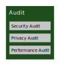

# Initial Architecture   Government Cloud   Statens IT

This document is an initial architectur for a project aiming at establishing the first version of a new development and operations model at Statens IT (SIT, eng. Danish Agency for governmental IT Services) based on cloud technologies and supporting agile development. The architecture describes which decisions that has been made and why, for each element in the reference model (link). Starting with the most salient for the first known applications (DMI, Myndighedsfortegnelse)

| Date | Version | Usages
| --- | --- | ---
| **20180903**| **0.1** | Used for first workshop
| *20180927?*| 1.0 | Support for decision in ??

## Introduction
[Project setup...]

The purpose of SIT is to provide better, safer, and more cost-efficient it operation and service to the Danish Government. SIT has focus on accessibility, stability, efficiency and information security in four main areas of operation: PCs for state employees, it infrastructure, standardisation of generic administrative it and standarised vendor contracts.  Currently SIT services 12 of 19 ministeries with around 17.000 employees at 250 physical locations, and is scheduled to expand to more ministeries for a total of 35.000 employes. Ministery of Defense, The Police and The Tax Authorities will then be the only areas with seperate it operations.

Digitaliseringsstyrelsen (DIGST, eng. Agency for Digitisation) was established in 2011 with joint public funding. [...]
>Digitaliseringsstyrelsens opgave er at udforme og implementere digitaliseringsinitiativer og it-politik på tværs af den offentlige sektor. Digitaliseringsstyrelsen understøtter effektiviteten i den offentlige sektor via leverancer til borgere, private virksomheder og offentlige myndigheder i relation til fællesoffentlig digitalisering og it-løsninger.

>Digitaliseringsstyrelsen implementerer i den forbindelse en række fællesoffentlige projekter. Hertil kommer opgaver vedrørende it-politik samt it-sikkerhed, ligesom Digitaliseringsstyrelsen er sekretariat for Statens It-projektråd og udvikler og vedligeholder den statslige it-projektmodel.

DIGST and SIT are both part of the Ministery of Finance and employes about 250 people each.

The Digital Strategy 2016-2020 is a joint public strategy for all levels of governement: state, regional and local. Among the many initiatives in strategy to be supported by this architecture are *8.1 Good data and efficient data sharing* and *8.2 Robust operation of the common infrastructure*. During the realisation of the Digital Strategy it has become evident that public authorities on all level of government is struggeling with **time-to-market for new applications and integrations** that does not match the ambitions of integrated public service delivery, the ever-changing political and regulatory landscape and the  technological development in general.

A number of barriers to the desired speedier development has been identified [more about how?].

Compliance to legal and strategic requirements is a very time consuming aspect and has been extending both large and smaller projects with periods of years. Public procurement, personal data protection and protection of national infrastructure are highly regulated areas, but also characterized by generic and re-usable concrete elements. Strategies are developed on many levels and in many domains, thus a single project or application will be covered by many principles and requirements. Sometimes the strategies align well, other times not so much.

> Costs of sharing data are not related to the reciever of the data. The re-use of data for a different purpose than originally planned comes with a cost. Typically the data are stored in an application maintained by the data reponsible. And the cost usually appear on one budget, whereas the benefits is to be found at another.

Public administrative organisations are too small to carry a full professional environment for efficient/agile development. Even that IT plays an ever big role for efficient government, very few organisations has managed to build and maintain their own development.

Knowledge about application and data landscapes of other organisations are sparse. Even when organisation cooperate and depend on each other information about existing application and data with potential reuse is hard to come by.

Cloud technology is maturing but product categories, and more important their interfaces, are still plenty. Interoperability and 'moveability' of applications is typically not a priority in an emergent market where service differention is a driver. This results in a big challenge for the individual organisation and puts them in risk of significant vendor lock-in.

[RAD 'fælles service- og data-platform'?]

## Problem
An architecture is a solution to a problem.

SITs customers (ministeries and their agencies) are moving towards modern, cloud based platforms to improve time to market for new applications and integrations. SIT currently has no mature, formalised offering to meet this need. The problem can be describe as:

*What service offering will be the most attractive option for public agencies seeking the advantages of 'the cloud'?*

This document describes an initial architecture for a government cloud aimed at becoming customers prefered Operational Model at SIT. It consists of a blue print for a technical solution, a new governance model and a perspective for a future where SIT acts as a cloud broker.

SIT has a small number of suggested operational models that today provides the stability and security required by the customers. This new model is believed to be prefered over existing because of the following charactaristics:

- *Shorter development and rapid changes.* Based on experiences from the proof of concept, customers can expect a rapid deployment cycle. If the suggested goals for deployment and changes are met (see later), the GovCloud will match existing cloud vendors.

- *Compliance as a Service.* The GovCloud will differ from existing cloud vendors in regard to establising and assuring compliance with regulatory and strategy requirements. Clarification of compliance can add years to project time and is a major barriere to better time to market. The GovCloud will over time establish more compliance assurances and offer them as shared services. The focus will initial be on data protection, public procurement, and the joint public digitalisation strtegy.

- *Synergy.* Projects delivering compliance assurances as shared services is one kind of synergy. The sharing of cost related to identity and ressource management  is another. Since the GovCloud is expected to be used by many public organisations, the general software and development market will be familiarized with the environment and it processes. I an market perspective, the GovCloud can function as a harmonization of services, which can lead to an increased and more transparent competition.

To address customers new requirements SIT most extend existing operational model with a new high level use cases.

- *New Application development.* An existing customer at SIT wants to establish a new application. Early in the process SIT is identified as the future operations partner. Services and data on the GovCloud are identified as reuseable during reviews. The development follows agile principles and is partly supported by a development toolchain offered by SIT.

- *Reuse Application/Service.* A software vendor delivers an application to a customer of SIT. The vendor wants to deploy on the GovCloud preparing for more customers. The vendor sells a license to another SIT customer and SIT extends the installation and the software product is available to the new customer.

- *Datasharing.*
An existing customer at SIT wants to access data from another organisation. The data is not available at any existing dataservices. SIT suggests the data owner to replicate the data onto the GovCloud. The data user builds a custom dataservice and reuses existing security controls incl identity management.

- *Migrate existing application.* SIT has identified a customer application that is sutiable for hosting on the new GovCloud. SIT plans a transition with the customer and reuse a number of exsiting services and datasets in the Cloud and can turn off some application elements. [add SQL explenation]

## Principles
Good architecture is based on shared principles. Agreed principles can guide solutions to future unforseen problems and allow the GovCloud to evolve with less escalation of descissions and clarify where substantial diagreement exists. The strategic principle supporting the GovCloud is:

**Cloud First** - new applications and new integrations between existing applications are designed to take advantage of the charaterritics of a Cloud.

Cloud technology is maturing and has proven to support large scale operations and rapid development. Across public organisations there are still a many different understandings of a Cloud, but for the purpose of this document we focus on the following essential charaterristics: Consumer on-demand self-service, Provider resource pooling, Rapid elasticity and Measured services. A detailed describition can be found in the [definition from NIST](https://csrc.nist.gov/publications/detail/sp/800-145/final).

The Cloud First is further refined by a few issues spcific to the use of cloud technologies in a danish governement setting.

**Vendor neutral** - applications and data shall be movable from one cloud platform to another without unreasonable effort.

Public agencies can not allow there data or application to be locked-in to a specific vendor. From a regulatory view public procurement should support competition and not favour a specific propitary tehcnology or sole vendor. From a strategic perspective public services should be possbile to move between organisation, and to be intergrated into new operational landscapes.

Exposed interfaces are supported by Open Source. Interfaces towards customers and interfaces exposed internally between platform and applications shall be selected regards to their support in the open source community. Selecting open source supported interfaces ensures a licens-free fall back option, if the benefits of licensed implementions are not balanced with the price.

Applications are containarized. By choosing widely adopted container technologies the binding between applications and operation environment is broken. Containarized applications declare their required ressources and relies on configurations from their environement.

Propriatary technolgies are used with caution. When used, the imidiate benefits needs to be evaluated against the later cost from the binding. A part of the evaluation is to describe a likely exit strategy for replacing propiatary technology with more open.

**Cloud Broker** - cloud services are consumed through a central cloud broker.

Regulatory issues on the use of public cloud services for sensitive personal data in a government settings are still unclear. Even with clearification, some critical data are still to be kept on danish territory and under strict control. But even critical applications need better time to market and cloud technologies can support this. Hence the need for a onpremise infrastructure based on cloud technologies.

At the same time the cost efficiency of public cloud offerings are hard to match. But government organisations will soon find integration of cloud services can be too complexto manage. A cloud consumer may request cloud services from a cloud broker, instead of contacting a cloud provider directly. A cloud broker is an entity that manages the use, performance and delivery of cloud services and negotiates relationships between cloud providers and cloud consumers. [NIST definition of Cloud Broker](https://nvlpubs.nist.gov/nistpubs/Legacy/SP/nistspecialpublication500-292.pdf)

The cloud broker will take advantage of a competitative market by moving applications to the most best available platforms. Reason can be applications with no personal data or when needed capabilities are only accessible as SaaS at cloud providers.

**Designed for compliance**
> General contract, so no seperate tendering processes.
> seperate datamanagement
> audit.
> Public Architecture... Patternes from Reference Architectures are supported, Infrastructure can be reached through local services

**Continious service availabilty** - services are expected to run 24/7 even during new releases and platform upgrades.
> clear seperation of responsibilities, multiple instances in multiple versions. Automated testing

**Reuse of data and applications**
> Public Catalogues, standarised re-use processes, central (cross customer) user management.

**Pay as you go.../ unlimit..**
> No need to order specific ressources up front... free to try...

## Referencemodel model
To identify the different components in the architecture, we use a conceptual model based on a number of excisting frameworks, including
[Microsoft Cloud Service Foundation Reference Model](https://blogs.technet.microsoft.com/cloudsolutions/2013/08/15/cloud-services-foundation-reference-architecture-reference-model/), [IBM Cloud Garage Method](https://www.ibm.com/cloud/garage/), [OpenGroup IT4IT](http://www.opengroup.org/it4it) and [NIST Cloud Computing Reference Architecture](https://nvlpubs.nist.gov/nistpubs/Legacy/SP/nistspecialpublication500-292.pdf). A total detailed view of all elemements can be found in appendix of this document.

Four business domains...

*Platform Delivery* [Lifecycle management is different on shared platform, shared understanding of Cloud First and roadmap]

> The components in this subdomain serve as the conduit for translating consumer requirements into cloud services and for the provider to manage the delivery of the services to the consumer requirements throughout the service lifecycle. This subdomain contains components that represent:

> Service level requirements that must be defined when:
> * Designing technical capabilities implementations where the provider owns or manages the technical capabilities that enable the service
>* Evaluating services provided by an external provider that owns or manages the technical capabilities that enable the service
>* Processes that must be defined to ensure that a service meets its service level requirements throughout its lifecycle

> It’s critical to define and measure cloud services requirements as specifically as possible to ensure ongoing customer satisfaction with the service. The components in this subdomain are defined in the following sections.

*Development* [Not done by SIT, but vital in DevOps]

*Operations* [To support service with high availability]

> The components in this subdomain represent the processes that are applied to each service to ensure that it continuously meets the requirements that are defined by the components in the Service Delivery subdomain. Although many organizations define each of these components as standardized processes, the specific application of the processes often varies across services. The Management and Support components support the components of this subdomain.

> The following sections provide high-level detail about each of the process components in this subdomain. While many of the processes might be similar to the processes used to operate services without cloud characteristics in an organization, there are a few notable differences when operating services with cloud characteristics:

> * Processes are typically highly automated to minimize human error and labor
> * Consistent application of the processes is critical to meeting service level requirements. While this might state the obvious, many organizations that don’t provide cloud services to their consumers might not be as diligent in their operational processes as organizations that do provide cloud services.

*Audit*
Security, privacy and performance

> A cloud auditor is a party that can perform an independent examination of cloud service controls with the intent to express an opinion thereon. Audits are performed to verify conformance to standards through review of objective evidence. A cloud auditor can evaluate the services provided by a cloud provider in terms of security controls, privacy impact, performance, etc.

> Auditing is especially important for federal agencies as “agencies should include a contractual clause enabling third parties to assess security controls of cloud providers” [4] (by Vivek Kundra, Federal Cloud Computing Strategy, Feb. 2011.). Security controls [3] are the management, operational, and technical safeguards or countermeasures employed within an organizational information system to protect the confidentiality, integrity, and availability of the system and its information. For security auditing, a cloud auditor can make an assessment of the security controls in the information system to determine the extent to which the controls are implemented correctly, operating as intended, and producing the desired outcome with respect to the security requirements for the system. The security auditing should also include the verification of the compliance with regulation and security policy. For example, an auditor can be tasked with ensuring that the correct policies are applied to data retention according to relevant rules for the jurisdiction. The auditor may ensure that fixed content has not been modified and that the legal and business data archival requirements have been satisfied.

> A privacy impact audit can help Federal agencies comply with applicable privacy laws and regulations governing an individual‟s privacy, and to ensure confidentiality, integrity, and availability of an individual‟s personal information at every stage of development and operation [5].

Supporting IT components:

*Management and support*
> The technical capabilities components within this subdomain manage and support on-premises technical capabilities that host, manage, or support private, externally-consumed public, or hybrid cloud services. The requirements that these capabilities meet are defined by both the Service Delivery and Service Operations components in the environment, but the components also provide data to the Consumer and Provider Portal component that enables consumers to monitor whether the provider adhered to the SLA requirements defined by the Service Level Management component. When you select technologies to implement these components, keep in mind that the functionality of multiple components may be provided by a single technology or that multiple technologies may be required to provide a single component, or that multiple technologies may provide the same component, but in different ways.

*Platform*
> Platform components are aggregated with Infrastructure and Management and Support components to provide platform as a service (PaaS) services1. This subdomain does not include any technical capabilities components because Platform components are not critical to provide services in every service model, whereas the other technical capabilities components that are represented in the CSFRM are. Platform technical capabilities components are however, critical to providing platform services. If you provide platform services in your environment, either with platform technical capabilities that you manage or with platform technical capabilities managed by an external provider, you can add Platform components to the CSFRM, as appropriate. Examples of platform services that you might provide in your organization are data, media, and service bus. Platform components are sometimes provided as services that are consumed by Software capabilities, but they may also be consumed directly by end-users.

*Infrastructure*
[Owned to prepare for sensitive data]
> The components within this subdomain represent the technical capabilities that you manage that are required to host on-premises Platform, Software, and Management and Support technical capabilities components. You might use these components to enable IaaS services that you provide to consumers in the public, private, community, or hybrid deployment models1. You may also consume IaaS services provided by an external provider that manages the infrastructure components for IaaS services. The requirements that these components meet are driven by all subdomains within the CSFRM, but are generally heavily-standardized to facilitate both automation in the environment, and to optimize volume purchases of hardware and software.

## First Applications
The platform is a continious developement and identified by needs off customer application and prioritized in the platform service lifecycle process.

*DMI Data*
[Describe data to be shared, volume and latency]
[Describe the need for API keys]

*PubOrg*
[Describe data to be shared, volume and latency]
[Describe few sources and first know usages]

*Platform DevOps*
[Back Log is prioritized joint public]

## Design

### Service Delivery
Statens IT is the strategic appointed provider of IT operation and service to the Danish Government and shall as such provide the requested cloud environment.

| Design decision |
| --- |
| Government Cloud is a Platform as a Service offered by SIT within existing license to operate|

[Rational from customer requirements (to reduce maintaince of basic software)]

Customers are responsible for the developement and maintainance of applications, data management, awarding and revoking user rights and licensing of software.

SIT as a platform provider is responsible for updating platform software, automated testing of services after update, monitoring and reporting on services.

| Design decision |
| --- |
| SIT defines a new Operational Model (da. driftsmodel) in the existing framework and all customer applications using the Government Cloud are offered through it |
[Reuse grayed out elements below]

| Scope decision |
| --- |
| SIT offers a Development Toolchain to support agile application development. It is offered as Software as a Service under existing operational model |

[Rational from efficiency and synergy and not bloating the platform project]

| Design decision? |
| --- |
| Percieved unlimited capacity from consumer point of view? |
[otherwise not a cloud]
[pay as you gov, dev for free, what limits?]

#### Service Level

[Describe what should be in the operational model]

- Uptime for services
- Internet bandwidth
- Notfication after platform update
- Cost model
- Security notification processes
- Expected time from Artefact delivery to deployment
- Automated test requirements and criteria for automated deployment of artefacts.
- Scale up/down criteria

| --- |
| The Government Cloud has 24/7 operations support and development support during normal business hours |

SIT can restart, but not change configuration or code without consumers...

#### Service Lifecycle

DIGST defines the technical roadmap for the platform in collaboration with existing and future customers and SIT.

| Design decision |
| --- |
| The service life cycle of of the GovCloud is based on customer needs, in a baglog maintained by SIT ,and prioritized by a joint public group lead by DIGST |

[Rational from vendor neutrality, ownership to both 'business' and 'platform' direction]

> * Requirements for many of the processes that are defined in the Service Operations subdomain components in this article.
> * Requirements for many of the technical capabilities that are defined in the Management and Support subdomain components in this article.
> * The plan for how these requirements are to be met. While the processes and technical capability requirements might differ across services, they generally do not dramatically differ, because most organizations define a standard, and then try to adhere to it as much as possible.

> This component is a key enabler for customer satisfaction and results in the service level agreement (SLA) for the service, which is created from the outcomes of many of the components in this subdomain. This component has a close relationship to both the Business Relationship Management component and all Service Operations components.

### Platform Operations
[Existing processes are not suitable for DevOps and automation. New variants of existing processes are needed. ITIL and IT4IT are well supported in existing tools]

[+ terminology of applications, services, pods, image, artefact]

| Design decision |

Processes likely to be supported in existing Service Now tool
- Request Fulfillment
- Change Management
- Knowledge Management
- Incident and Problem Management

Processes likely to be supported by new tools decided by the GovCloud Team
- Access Management
- Asset and Configuration Management
- Systems Administration
- Release and Deployment Management

and...
- Create identities for Dataset and Application Instance
- Re-build, Test
- Deploy
- Capacity and Scaling
- Maintain images

| Design decision |
| --- |
| SIT (GovCloud team) establishes processes suitable for cloud platform operations based on the ITIL framework |

[To minimize Employee training, but new because cloud is different]

#### System Administration
[Different because responsible for platform and base images]

### Service DevOps
[Not at SIT, but important]
[Scoping of toolchain as a service]

| Design decision |
| --- |
| The Toolchain is provided as SaaS by SIT and delivers docker images into the artefact repository|
bring your own licens

- harmonization
- time-to-market
- integrated with identity management
- to allow alternative toolchains at consumers

| Design decision |
| --- |
| The Toolchain is based on Confluence, Jira, Git, Build?, Test?|
OpenSource?

| Design decision |
| --- |
| The Government Cloud is born with sand boxes for each existing customer |

[rational from time to market and spreading the news...]

#### Build
| Design decision |
| --- |
| Docker images are build from source using Maven?|
[Run identical builds on local development ]

### Audit

### Management and support

- No Portal in first version
- No Billing in first version
- Process Automation (left to the team to build ad hoc)

| Roadmap decision |
| --- |
| Portal later...  |
[too few consumers, and needs not known]

Describe intention about DevOps through selfservice, Same views and (mostly) controls as SIT employee.

- Authorization (not needed in the first two applications. Future services can use attributes from datasets and roles/rights from AD)

| Scope/Design decision |
| --- |
| Consumer Authorization outside platform with common STS service|

- Authentication (platform administrator using the existing SIT solutions, other users in application)

[Tegning af STS, efter dialog med Jan]

- Data protection (use build in platform, but still processes)???
- Deployment and Provisioning (reuse existing)
- Network Support (use existing)

| Scope decision |
| --- |
| Deployment and provising of hardware, network support and data protection needs to |

#### Service Monitoring

| Design decision |
| --- |
| Applications and services implement a common  schema for monitoring, logging...  and are monitored and reported in SITs existing tool (Nagios?)|

Monitoring adskilt fra Reporting
[Tegning af service i container]
[Ping and trace]
[Log content and format]

#### Service management
> This component consumes Service Monitoring data and produces reports that describe the actual service level metric values exhibited by a service over regular time intervals. The report data can be compared to SLAs to determine whether the service met its SLAs during the reporting interval that is specified in the SLA. The data from this component is provided to consumers through the Consumer and Provider Portal component. This component is a primary enabler for the Service Level Management and Business Relationship Management components.

> This component monitors service levels of all technical capabilities that are used to provide each cloud service. The Service Reporting component consumes the data from this component. Optimally, the Service Monitoring Component is able to integrate with the Service Management component so that it can auto-generate incidents based on defined criteria.

> This component supports most of the Service Operations components and integrates data from the following Management and Support components:

> * Incident and Problem Management
> * Configuration Management
> * Service Monitoring
> * Service Reporting

>The data integrated by the Service Management component is typically exposed through the Consumer Portal component so that various individuals can view it.

#### Configuration Monitoring

#### Authorization

#### Authentication

#### Directory
Directory (reuse existing)

| Design decision |
| --- |
| Users, Applications and Dataset are ressources registered in SITs existing Active Directory.|

#### Data protection

#### Fabric Management

#### Artifact repository

| Design decision |
| --- |
| The artefact repository is [Docker Registry Server](https://docs.docker.com/registry/deploying/#use-an-insecure-registry-testing-only) |

Configuration of environments are done via management.

Artefact are identified in the AD, semantic versioned and taged (production, preprod, latest...)

### Platform

| Design decision |
| --- |
| Three seperate layers |

- compliance
- moveability
- data management

#### Gateway

| Design decision |
| --- |
| The API Gateway is [KrakenD](http://www.krakend.io/) |
- scaleability,
- distributed configuration
- OAuth

#### Application fabric

| Design decision |
| --- |
| The application environment is [Kubernetes](https://kubernetes.io/) |
- No need for management tools yet.
- Kubernetes is the core technology.
- Selfservice and automation is build on top in future versions.

#### Data fabric

[add keylines from storyline]

| Design decision |
| --- |
| The data fabric is [MapR](https://mapr.com/) |
- manageability,
- access control,
- scale out,
- clustering

### Infrastructure

| Roadmap decision |
| --- |
| Scale out and multiple cloud providers as needed, but not initial |
- on premise because we want to test and prepare SIT to handle sensitive data

[Consider Hardware certification??]

| Design decision |
| --- |
| The on-premise application and data fabric runs on non-virtualized hardware under CentOS |

- no Virtualization to reduce complexity/licensing and performance storage

- same os to minimize learning, but specific to cloud, but seperate for tuning

[decision?]Active/Active Cross..

#### On-premise Compute
> This component represents physical servers, which include resources such as processors, graphics processing units (GPUs), random access memory (RAM), network interfaces, and the storage necessary to host hypervisor software for the physical server.

> This component represents physical storage that is accessed by Compute devices via some networking technology. Types of data that are often stored on this component are virtual machine hard disk files or consumer data or both. Although the Infrastructure and Management and Support components that are necessary to provide services in the infrastructure as a service (IaaS) service model1 exist in the CSFRM, they are not represented solely to enable IaaS services. They’re represented because they’re necessary to enable any type of cloud service.

#### On-premise storage

#### Network
> This component represents the physical network switches, routers, firewalls, and cabling. It also represents logical networking constructs including virtual local area networks (LANs), access control lists, quality of service, and network interfaces defined in converged network architectures.

[Network in Kubernetes]

| Design decision |
| --- |
| What kind of seperation? |

## Appendix

### 2019Q2

Platform goals for first version:

- From prototype to production < 1w, Chages in production < 1d
  - supported by toolchain.
  - build and test shared by dev and ops.

- Rebuild services on platform updates
  - automated test and acceptance.
  - multiple versions of same services.

- Performance and near liniar scaling
  - Service monitoring and reporting
  - ressource limiting

### Future releases

* Formalized operation model

* self service and DevOps

* Consumer Portal

* Authorisation and Authentication

* Automated Billing

### Referencemodel

