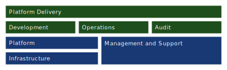
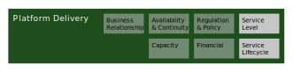
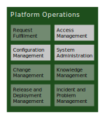
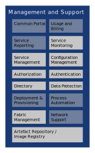
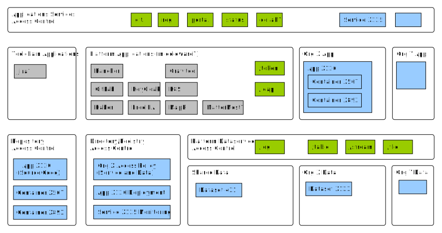
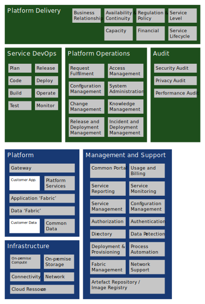

# Initial Architecture   GovCloud PaaS  Statens IT

This document is an initial architecture for a project aimed at establishing the first version of a new operating model at Statens IT that uses cloud technologies to provide a managed platform for agile application development, the GovCloud PaaS. The architecture describes which decisions that has been made and why for selected elements in a reference model.  Decisions reflect the needs identified for the first know applications and support a longer strategic perspective on the increased use of cloud technologies in the Danish public sector.

The first use of the document supports a decision of how to best host free of charge meterological and climate data for government and private data users starting from late 2019 and how to support agile development of a public sector registry by the Agency for Digitisation.

Statens IT also provides a GovCloud IaaS based on OpenStack. This service is not specified in this document.

Edited in September 2018 by [Mads Hjorth](mailto:madsh@digst.dk), Digitaliseringsstyrelsen.

| Date    | Version  | Usages
|--------:|---------:|:-------------------------------------------------------
| 20180914| 0.7 | Internally reviewed, discussed with DMI and SIT 201809119
| 20180920| 0.9 | Distribution for board meeting 20180924
| **20180924**| **0.9.1** | Distribution for board meeting 20180924
| *20180926*| *1.0* | Distribution for sponsor meeting 20181003

[Table of Content]

# Executive Summary
SIT GovCloud PaaS is an enterprise-grade, on-premise Cloud Platform based on Open Source and Open API´s delivered, maintained and monitored 24/7 by Statens IT, compliant with Danish regulation and Government best paractices on Security, GDPR and IT-architecture and made available to all Danish state institutions on attractive economical and administrative terms. 

This document describes the architecture and capabilities of the first version of the GovCloud Platform Service. The architecture establish the first principles as:
*Continuous service*, *Vendor Neutrality*, *Highly Scalability*, *Security-by-design* and *Predictable Cost*. All in anticipation of a future strategic princple of *Cloud First*.

The design is based on a industry reference model and includes three main business roles: Policy Owner, Platform Provider and Platform Consumer.

DIGST shall in the role of GovCloud PaaS Policy Owner in relation to Platform Delivery:

- be responsible for establishing a forum for decisions for the platform and toolchain, and continuously publish an updated feature catalogue ([Service Lifecycle Management](#service-lifecycle)).
- in collaboration with SIT provide access to guides, training and courses for existing and prospective users of the GovCloud on using the platform and toolchain in accordance with the Federated Digital Architecture ([Service DevOps](#service-devops)).
- assist SIT in ensuring that the GovCloud PaaS is compliant with best government practices on GDPR and cyber security (Regulation and Policy).

SIT shall in the role of GovCloud PaaS Provider in relation to Platform Delivery, Platform Operations :

- be responsible for the establishment of an Service Level Agreement for GovCloud PaaS with suporting processes that includes 24/7 support on operation, rolling updates of platform and application service monitoring ([Service Level](#service-level)).
- be responsible for the operation of a GovCloud PaaS using MapR, Kubernetes, Docker and KrakenD on premise ([Platform](#platform)).
- provide and operate a DevOps toolchain, including a virtual machine image for decentralised, autonomous build and test, as SaaS integrated to existing identity management ([Service DevOps](#service-devops)).
- Provide and operate tools for managing incidents in collaboration with Platform Consumers, their application developers and required technology providers ([Platform Operation](#platform-operations)).
- provide and operate platform services for Build and Test Images, API management, Secure Token Service, Log Service, Rate limiting ([Platform Services](#platform-services)).
- provide a sandbox environment for prospective users of the platform and toolchain ([Test](#test)).

DMI and DIGST shall individually in the role of GovCloud PaaS Consumers:

- Develop, deploy and operate application services, including automated test criteria, using the virtual machinge image provided by SIT [Service DevOps](#service-devops)).
- Cover licensing cost if using the GovDevTool provided as SaaS by SIT ([Service DevOps](#service-devops)).
- Provide estimates to SIT for capacity planning ([Service Lifecycle Management](#service-lifecycle)).
- Establish collaboration processes for 24/7 support (Service Operation).
- Establish processes for onboarding data and service consumers (Service Operation).

## Introduction
In the spring of 2018 a collaboration between the Danish Meteorological Institute (DMI), the Agency for Governmental IT Services (SIT) and the Agency for Digitisation (DIGST) developed a proof of concept exploring a number of cloud technologies and practices. This architecture is a result of a that experience.

The Danish Meteorological Institute (Dan.: [Danmarks Meteorologiske Institut](http://www.dmi.dk/en/about/profile/introduction-to-dmi/), DMI) provides meteorological services in the Commonwealth of the Realm of Denmark, the Faroe Islands, Greenland, and surrounding waters and airspace. The purpose of all activities is to safeguard human life and property. DMI’s many activities also act as background knowledge in terms of planning and decision-making in economic and environment sectors - especially within transport and industry businesses. DMI collects and processes meteorological, climatological and oceanographic measurements/observations, and measures, collects and compiles related geophysical parameters throughout the Realm. Conducting research and development within its area of expertise, DMI ensures efficient operations and state-of-the-art quality in all productions while monitoring and conducting research on global warming and the stratospheric ozone balance.

The purpose of the Agency for Governmental IT Services (Dan.: [Statens IT](https://statens-it.dk/english/), SIT) is to provide the Danish Government better, safer, and more cost-efficient IT operations and services. SIT focuses on accessibility, stability, efficiency and information security in four main areas of operation: personal computers for state employees, IT infrastructure, standardisation of generic administrative IT and standardised vendor contracts.  Currently SIT services 12 of 19 ministeries totalling 17.000 employees at 250 physical locations, and is scheduled to expand to more ministeries for a total of 35.000 employes. At this point, The Ministery of Defence, The Police and The Tax Authorities will be the only areas with separate IT operations.

The Agency for Digitisation (Dan.: [Digitaliseringsstyrelsen](https://en.digst.dk/), DIGST) was established in 2011 with joint public funding. Its purpose is to create and implement initiatives and policies regarding the digitalisation of the public sector. DIGST supports public sector efficency by providing digital services to citizens, businesses and government organisations. DIGST implements joint public projects and hosts The Danish Council for IT Projects and the government IT project model.

DIGST and SIT are both part of the Ministery of Finance and employs about 250 people each.

The Digital Strategy 2016-2020 is a joint public strategy for all levels of government: state, regions and municipalities. Among the many initiatives in the strategy to be supported by this architecture are *8.1 Good data and efficient data sharing* and *8.2 Robust operation of the common infrastructure*. During the realisation of the Digital Strategy it has become evident that public authorities on all levels of government struggle with a **time-to-market for new applications and integrations** that does not match the ambitions of integrated public service delivery, the ever-changing political and regulatory landscape and the  technological development in general.

Integrated in the The Digital Strategy is a joint public architecture framework, the Federated Digital Architecture (FDA, Dan. Fællesoffentlig Digital Arkitektur). Within the framework a number of reference architectures have been approved, especially the reference architecture for *sharing of data and documents* [Indsæt link?] is relevant for this project. The GovCloud PaaS concept is an implementation of the pattern *shared data and application platform*.

## First Applications
Paramount to the establishment of a Government Cloud PaaS is the succesful support of an initial large scale strategic project to prove the attractiveness of the architecture.

It has been the focus of a proof of concept to create collective experiences in different organisations, and this focus is continued in the initial version of the GovCloud Platform. DMI is an experienced application developer and service provider, and has applied this knowledge to support the development of this design. DIGST is experienced in policy development, and SIT has established mature IT operations. However, neither have experience with agile application developement. Hence DIGST has choosen to also take the role of application developer in a smaller project and SIT will use the platform to build its own platform services.

As drivers for the initial version of GovCloud PaaS, the following three applications have been choosen:

**DMI Data.** Meteorological and climate data are distributed widely today. The government has decided to provide these data under a open government data initiative to support growth of private businesses. DMI sees a potential of separating the generic operational aspects of data sharing from the knowledge and support of the specific data they produce.

In the future, data distribution to private consumers and other government organisations is expected to be done on the same infrastructure, whereas highly critical data distribution e.g. crisis management and defence, will continue in separate channels.

Experiences from countries with free-of-charge meterological data have shown the need for a way to contact data consumers in the case of e.g. erroneous data from failing sensors. As such DMI wants to register data consumers to support this. Registering data consumers also supports enforcing a *fair use* agreement.

**PubOrg.** Data on the different levels of the Danish public sector and different domains within these levels are abundant. However, current data services are configured to meet domain specific purposes and as such do not support the inter-domain collaboration necessary to support e.g. citizens' contacts with a plurality of authorities and public sector entities. PubOrg addresses this by providing complete, coherent and consistent generic data on all three layers of government.

Data is provided by real time gathering and harmonising domain specific data from existing registries. When fully implemented, PubOrg is expected to contain data on approximately 20.000 public sector entities and their respective leaders.

The first known usages for PubOrg is as support for the implementation of Next Generation Digital Mail, the service Borger.dk, and the publication "Det Offentlige Danmark".

**Platform DevOps.**

[Development of platform services]

Storage needs, compute and network estimates for first applications are shown in the table below. Unreplicated data and external bandwith. All numbers are in giga bytes (GB).

| Applications | Providers | Daily In | Co. | Storage | Daily Out | Consumers    |
| ---          | ---       | ---:     | ---:| -------:|---:       | ------------ |
| Observations | DMI       | 1        | -   | 1.000   | 25.000    | Government, private |
| Radar        | DMI       | 15       | -   | 1.500   | ?         | Government, private |
| Forecast     | DMI       | 6.000    | ++  | 42.000  | 48.000    | Government, private |
| PubOrg       | KL,SDS,FM | 1        | -   | 1.000   | 1         | Government |
| Platform     | SIT       | 5        | +   | 1.000   | 1         | DMI, DIGST, SIT |

[Waiting for current daily out data for existing DMI data consumers or result from PWC forecast]

## Problem
Customers of SIT (ministries and their agencies) are increasingly seeking to move towards modern, cloud based platforms to improve time to market for new applications and integrations. SIT currently has no mature, formalised offering to meet this need. The problem can be describe as:

*What service offering will be the most attractive option for public agencies seeking the advantages of 'the cloud'?*

To address this problem , this document describes an initial architecture for a government cloud platform aimed at becoming customers' prefered Operating Model at SIT and pawing the way for increased usage of cloud technologies by SITs customers. It consists of a new governance model and a blue print for a technical solution supporting Platform-as-a-Service.

Currently, SIT has a number of operating models (including ones based on SaaS and IaaS) that provide the stability and security required by the customers. This new model is believed to be preferred over existing ones because of the following characteristics:

- *Continuity of Service.* Existing models allow small and planned windows for maintainance. Cloud technologies typically offer a continuity with rolling updates of both platform and applications without any interruption.

- *Shorter Development Cycles and Rapid Changes.* Based on experiences from the proof of concept, customers may expect a rapid deployment cycle. If the suggested goals for deployment and changes are met (see [appendix](#suggested-initial-roadmap)), the GovCloud Platform will match that of existing cloud vendors.

To support the first applications, SIT must extend existing operating models with new high level use cases.

- *Public Data Distribution.* A private company wants to access data from a public organisation. SIT has suitable operating models and technology platform to support the re-use of public sector information. The government organisation holding data entrusts operational aspects to SIT in order to focus on tailoring the data service application and to help end users understand the data.

- *Application Development.* A government organisation decides that the GovCloud Platform is the future home of a new application. Early in the process SIT helps identify reusable services and data on the GovCloud Platform. Furthermore, SIT provides a sandbox environment and a toolchain for developers to produce initial proof of concepts. DIGST supports the project.

 
Future versions of the GovCloud are expected to add capabilities supporting Compliance as a Service, Development Procurement Framework, _Sharing of Sensistive Data_, _Reuse Applications/Services_, _Hybrid Cloud/Scale Out_, and _Migrating Existing Applications_ (see [appendix](#more-principles,-capabilities-and-use-cases)).

## Principles
Good architecture is based on shared principles in order to assist solutions handle future unforeseen problems. A foundation of shared and agreed principles also ensures that the GovCloud Platform may evolve with less escalation of decisions, as well as the process of describing said principles aligns stakeholdes and unearths disagreements if any.

The following principles have been identified:

**_Continuous service availability_: GovCloud platform and application services are built to deliver uninterrupted service even during new releases and platform maintenance.**

Applications used by public agencies are often critical, not only to the agency itself, but to society in general. However, most services have traditionally had so called service windows, where services were suspended to allow for new software relases. Digital self-services have changed this. The general public is now serving itself at times suitable for the costumer instead of the service provider.

In relation to the GovCloud Platform, this means deployed services run continuously and must be built accordingly. Cloud technology  ensures this related to infrastructure and platform, but application services must also be designed for high availabilty, automated testing and detailed monitoring.

Problems must be solved immediately and in close collaboration between platform provider, platform consumers and application providers. The GovCloud provides clear separation of responsibilities, but recognises that solutions are found in collaboration, and that the collaboration must be supported efficiently by tools provided as part of the GovCloud.

High availability is not only a concern for the platform itself, but is a result of meticulous planning of all dependencies ranging from electrical power and bandwidth to incident reaction time and capacity to solve problems when they arise.

Service availability is an extension of the cloud characteristic of measured services. The health of the platform and its individual services must be monitored continuously.

**_Vendor Neutrality:_ Applications and data shall be portable from one cloud platform to another without unreasonable effort.**

Public agencies cannot allow their data or applications to be locked-in to a specific vendor. From a regulatory point of view, public procurement should support competition and not favour a specific propriatary technology or sole vendor. From a strategic perspective, it should be possible to move public services between organisations, and additionally have them integrated into new operational landscapes. This principle supports the characteristic of provider resource pooling.

Exposed interfaces are standardised and supported by Open Source implementations. Interfaces towards customers and interfaces exposed internally between platform and applications shall be selected on the basis of their support in the open source community. Selecting interfaces suopported by open source ensures a licence-free fall back option, if the benefits of licenced implementions no longer  outweigh the price. Standardisation ensures a clear governance of changes and transparent terms of use.

Consequently, proprietary technologies are used with caution. When used, the immediate benefits are evaluated against the future costs of the binding. A part of the evaluation is to describe a likely exit strategy for replacing proprietary technology with more open ones.

Furthermore applications are containerised. By choosing widely adopted container technologies the binding between applications and operations environment is broken. Containerised applications declare their required resources and rely on configurations from their environment.

**_Highly Scalable_: Governance, operating processes and technology support a high number of applications with a limited need for addition of resources.**

The governance at SIT is based on inter-agency agreement and differs from contracts with private cloud providers in many ways. One of the reasons a GovCloud can be made economical attractive is the inherited trust between government organisations and a cost effecient way of handle disagreements in a broader organisational and at times political context.

The ensure this agreement-based process run smoothly the number of hard requirements should be kept low in favour of stable and accepted fora to resolve incidents and unforseen problems. One pillor of a efficent governance is the principles and rules related to *Fair Use*. All cloud environment has house roles, but private providers often regulated the user behaviour to these roles by price models. The complexity of private cloud models add at least one extra layer of decissions in a project, and is to be avoided here for the sake of time-to-market. The *Fair Use* rules should cover elements like informing platform providers when expected capacity is known to change, public facing APIs are called in unintented ways and better alternatives exists or applications spend excessive ressources compared to similar applications.

The scaleability is not ensure by consumers following basic rules alone. Each governance process, ressource cost, choice of tool etc must be made with the intend of scalability. In example meetings should be held on regular frequencies, rather on ad hoc basis. Cost to licenses should be scale with capacity and not by end user. Tools should have open APIs to support the difference in preference from new users.

Finally self-service and automation is needed to scale to the number of potential customer in a national governement settings.

**_Security-by-design_: The platform is designed to enforce security on application by default.**

Security is one of the areas of high regulation and compliance as a service is therefor a large benefit for platform consumers. The GovCloud platform is initially build with authentication, authorisation and data protection suitable for the identified first applications.

The platform and its hosted application most follow specific security practices. Most are decided in the joint public Digital Strategy and further described in the Federate Digital Archictecture. Technology and tools for the platform must be choosen to support known existing needs, but also with a promise of continuosly improvement on security issues over the licensing period.

New processes and platform services are needed when the number of customers grow or applications using person or other sensitive data is hosted. Code inspection, network monitoring, predictive log analysis and automated responses should be added to the roadmap as needed.

**_Predictable Cost_: The operating model ensures predictable consumer costs suitable for public sector budget guidelines.**

Government organisations are interested in fixing variable Costs, or at least having defined caps, to control risk and comply with guidelines. That being so, The GovCloud cost model must align with other budget items and not expose consumers to greater economic risks than other technological solutions.

Specific application services to suit the needs of other government organisations for data acess, should generally be developed by the data consuming organisation. But this does not help limit costs when data services are exposed to the general public. In this case *fair use* agreements could be made with data consumers and their compliance monitored.

Costs should reflect the use, maintenance and continuous improvement of the GovCloud. Consumers with services deployed on the platform should not be required to contribute beyond the initial agreement for continued hosting. In the case of new services or considerable change in use patterns, costs should re-negotiated.

 
In future versions new principles may be included e.g.  *Compliance as a Service*, *Reuse of data and applications*.(see [appendix](#more-principles,-capabilities-and-use-cases))

The GovCloud is also expected to support a larger government initiative on benefitting from cloud technology. A future strategic general principle could look like the following:

**_Cloud First:_ Cloud technologies are preferred when designing new applications and new integrations between existing applications.**

Cloud technology is maturing and has proven to support large scale operations and rapid development. The essential charateristics of a cloud are Consumer on-demand self-service, Broad network access, Provider resource pooling, Rapid elasticity and Measured services cf. [NIST](https://csrc.nist.gov/publications/detail/sp/800-145/final).

Cloud First means that cloud technology should always be considered when designing new applications and integrations. Simply because the above mentioned characteristics are generally desirable and for the foreseen future best can be reached by the use of cloud technology. However, a Cloud First principle entails second and perhaps third line alternatives. Organisations should always choose the best tool for the job, duly respecting the relatively long life time of government it-solutions and the everchanging overall organisation.

## Reference model
To identify the different components in the architecture, we use a conceptual model based on a number of excisting frameworks, including
[Microsoft Cloud Service Foundation Reference Model](https://blogs.technet.microsoft.com/cloudsolutions/2013/08/15/cloud-services-foundation-reference-architecture-reference-model/), [IBM Cloud Garage Method](https://www.ibm.com/cloud/garage/), [OpenGroup IT4IT](http://www.opengroup.org/it4it) and [NIST Cloud Computing Reference Architecture](https://nvlpubs.nist.gov/nistpubs/Legacy/SP/nistspecialpublication500-292.pdf). A total detailed view of all elemements can be found in the appendix of this document.

From the frameworks above, a number of business roles and processes have been selected for this architecture. The business roles are Cloud Consumer, Cloud Provider, Application Responsible, Application Developer, and Data Responsible. One additional role is introduced in order to support the aspects of cloud usage in a government setting, i.e. Cloud Policy Owner.

The business processes for a cloud platform can be organised in four main areas:

*Platform Delivery.* This area translates Cloud Consumer requirements into platform services. Capabilities and technologies are provided with a specific service level agreement. All changes follow a transparent governance process with consumer involvement.

*Development.* This area translates requirements into application services. Development is often done by a third party Application Developer acting on behalf of a Platform Consumer, but can also be done by a Platform Consumer's employees. Platform services follow the same processes and are developed by Cloud Provider employees or third parties acting on behalf of the Cloud Provider. Application services can be generalised into platform services in a collaboration between Policy Owner, Platform Provider and Application Responsible.

*Operations.* This area encapsules processes applied to the platform and its applications to meet the requirements in service level agreements. Processes are typically highly automated to minimise human error and labour. End-user behaviour is monitored to continuously improve services.

Processes in Development and Operations are increasingly considered as overlapping, especially in the case of self service cloud services, where a consumer has a larger part in the operational aspects of service delivery. One definition of [DevOps](https://en.wikipedia.org/wiki/Special:BookSources?isbn=978-0134049847) is *a set of practices intended to reduce the time between committing a change to a system and the change being placed into normal production, while ensuring high quality.*

*Audit.* Auditing are processes of independent examination through controls with the intent to express an opinion. An opinion can be on the compliance with standards. Audits are based on objective evidence and may evaluate terms of security controls, privacy impact, performance, etc.

 
The four business areas above are supported by technology components in three areas:

*Management and support.* The components in this area support the capabilities defined by the DevOps business area and support the consumer self-service characteristics of a cloud. Components also provide data to Platform and Service Delivery supporting Measured Services and fair billing.

*Platform.* Platform components are aggregated with Infrastructure and Management and Support components to provide Platform as a Service (PaaS). Platform components are mostly provided as services to be consumed by applications, but they may also be consumed directly by end-users.

*Infrastructure.* Infrastructure components provide the necessary environment to run the platform. Infrastructure can be on-premise or extended with Infrastructure as a Service from an private provider. Infrastructure is heavily-standardised to facilitate both automation in the environment, and to optimise volume purchases of hardware and software.

## Design
The initial design of the GovCloud consists of a number of design decisions and the rationales behind them. Decisions are named in bold and brackets throughout the description of each element. During the establishment, decisions can be changed following the established service lifecycle management processes.

The business areas (green) of the reference model is the focus of the interaction between GovCloud Consumers and GovCloud Provider. The technology areas (blue) are included to verify that business processes are supported by technology and that no technology areas are left un-governed.

### Platform Delivery

Statens IT is the strategically appointed provider of IT operation and service to the Danish State-level Government and shall as such provide the requested cloud environment.

**[PaaS]** The operating model of GovCloud PaaS is Platform-as-a-Service offered by SIT within existing licence to operate.

NIST defines the capability provided to the Platform Consumer in the PaaS operating model as: *to deploy onto the cloud infrastructure consumer-created or acquired applications created using programming languages, libraries, services, and tools supported by the provider. The consumer does not manage or control the underlying cloud infrastructure including network, servers, operating systems, or storage, but has control over the deployed applications and possibly configuration settings for the application-hosting environment.*

PaaS is choosen over IaaS to limit the ammount of operational knowledge required by government organisations. SIT is organised to lift this requirement from other organisations.

As such, Platform Consumers are responsible for the development and maintainance of applications, data management, awarding and revoking user rights and licensing of software. SIT as a Platform Provider is responsible for updating platform software, automated testing of both applications and platform ensuing updates, and monitoring and reporting on services.

The GovCloud PaaS operating model is based on a collaborative agreement between government organisations and follows existing practices. Most importantly, this does not allow for economic sanctions and private law contracts. Conflicts are to be solved through existing government fora and budgetting practices.

SIT has established business support functions across a few operating models. Initially PaaS will be a supplement to existing models and will benefit from established practices concerning agreements, reporting and financing. SIT's existing SaaS offering will still be provided. SIT may use the GovCloud as a basis for new SaaS offerings to further harmonise the operational environment.

 
For the initial applications, processes related to the management of Platform Service Lifecycle and Platform Service Level need to be established.

#### Service Lifecycle
Transparent governance processes are necessary for Platform Consumers to evaluate fit-for-purpose of the operating model.

**[Consumer driven]** The service life cycle of GovCloud is based on consumer needs, in a feature catalogue maintained by SIT, and prioritised by a joint public group of Cloud Consumers lead by DIGST in cooporation with SIT.

Establishment of platform services, changes to service level agreements and exposed interfaces are the primary areas of governance. To support the principle of vendor neutrality, supported interfaces must be carefully curated and choices should support a higher purpose, general 'business' strategy and the Federated Digital Architecture (FDA).

In a two-way negotiation between consumer and provider on individal projects, the overall strategic goals of goverment-it is at risk of taking second priority. To ensure the alignment of overall strategy and it-roadmaps, the responsibility of roadmap decisions is placed with the Platform Policy Owner.

**[Support lifetime]** Each supported feature (technology, interface or platform service) in GovCloud has a planned minimum lifetime supporting Cloud Consumers' long term planning. Backward compatibility is sought for running applications.

The products used to implement the platform will likely have many features that are less desirable to have an application depend on. To support the principle of vendor neutrality (and its goal of portability of applications) only a subset of said features is selected and supported.

When designing applications, Platform Consumers must make informed decisions about the use of available features of GovCloud. Therefore planned support lifetime for each feature must be explicit. For technologies the vendor support and for interfaces the release plans of standard organisations should be taken into consideration. Platform services are more locally controlled and the support time can be agreed upon among current service users.

Application developers may have valid reasons to use unsupported services, and often development time and code lines can be greatly reduced by clever use of a platform. When applications rely on unsupported features, it is important to estimate the immediate savings and compare those with future costs in the event of unsupported features becoming unavailable.

Unsupported features will be used and Platform Consumers should be alerted as soon as they are brought to the attention of the Platform Provider is aware of planned changes e.g. in updated roadmaps from technology providers.

Platform Consumers should be alerted as soon as planned changes to unsupported features, e.g. by means of updated roadmaps from technology providers, are brought to the attention of the Platform Provider.

#### Service Level
The selected operating model (PaaS) clearly separates the responsibilities of the Platform Provider from those of the Platform Consumer. However, in government collaboration, a running platform with a failing application is a failed public service. Citizens and businesses only care that the service is restored and not which part of government (or even private vendor) is to blame. As such, service levels and separation of duties are designed to support a common goal of high service availability.

**[24/7 platform]** SIT continously monitors all services, reports swiftly on incidents, initiates problem solving and brings in support from external professional services when necessarry.

When SIT identifies a failing service an incident is created. First efforts are made to restart services and identify underlying problems. SIT cannot be expected to have knowledge of the internal workings of applications, and if first efforts do not restore services, the service provider is involved. The SLA includes specific reaction times and escalation criteria.

SIT does not support the deployment of new releases outside normal business hours (except in the process of resolving incidents).

**[24/7 services]** Platform Consumers wanting to host 24/7 application must provide resources to collaborate with the Platform Provider on solutions to incidents.

Platform Consumers help identify problems by providing knowledge of the inner workings of applications. When Platform Provider and Platform Consumer agree on the cause of an incident a suggested solution is decided upon. Solutions can be fixes to platform services, workarounds delivered as new application versions or combinations hereof.

Highly available services are a result of careful design, early detection of problems and the required capabilities to fix them. Careful design is supported by development guidelines and general cloud practices. Detection of problems is supported by automated testing and health monitoring. Required capabilities cover both specific products, their configurations, dependencies and underlying infrastructure. The availability and cost of these support from technology providers must be considered when deciding the roadmap and should be contractually specifie by the Platform Provider when possible.

Processes of identifying and resolving problems are separated from incident management. SLA should also govern Platform Consumers' responsibility to participate in this process when needed.

### Platform Operations

Existing established processes at SIT are not all suitable for DevOps and automation. Since ITIL and IT4IT are well supported in existing tools and a considerable amount of training has been done both at SIT and it's customers, new processes are based on the ITIL and IT4IT frameworks.

**[ITIL]** SIT establishes processes suitable for cloud platform operations based on the ITIL framework.

The required service uptime has consequences for the design of especially the incident process. The time of incident (during normal business hours, weekends or international holidays respectively) will influence e.g. the contact information to use, which resources are preferred and when to report to management.

The initial applications will impact existing processes for Access Management, Configuration Management and System Administration.

#### Access Management
The use case Public Data Sharing, combined with the specific need to identify consumers of DMI data, is not covered by existing access management at SIT. Consequently,

**[API Keys]** Public Data Sharing is supported by a GovCloud platform service for API key management.

Specifically, the Platform Consumer establishes processes for on-boarding data consumers and SIT provides a back-end service to generate and store API keys and contact information. The API Key management should be generic and be used for all applications that share public data with private businesses and the public in general.

**[Existing IAM]** Identities and access rights necessary for the development of applications and operation of the platform are stored in SIT's preferred central Identity and Access Management system.

#### System Administration
Operating the platform 24/7 might require employees to work from home or on the road.

**[SysAdm tooling]** Operators at the Platform Provider choose tools suitable for automation and remote management based on individual experiences.

Since the efficiency and comfortableness of platform operators have a huge impact on service levels and quality of solutions, the choice of tools must also take into account individual preferences.

#### Configuration Management

The configuration of GovCloud is done internally in SIT. For the first version, configuration changes to applications are sent to SIT and manually applied. This process is covered by the SLA.

**[Manual Config]** Tools initially chosen for configuration management by the Platform Provider must support future self-service for Platform Consumers.

Configuration is under version control and should have high availabilty matching other critical parts of the platform.

### Service DevOps

The development and operation of applications must be supported by an efficient toolchain. To help government organisations adapt agile development in a cloud setting, a joint public, fully supported enterprise grade toolchain integrated with the CovCloud Paas is provided by SIT.

The use of the toolchain is recommended and can function as a guide for competences across development vendors. However, not all Platform Consumers (and more importantly their developers) can be expected to adhere to tool choices made by Platform Policy Owner. Consequently,

**[Gov Dev Tool]** SIT offers an enterprise grade 'Government Development Toolchain' as Software-as-a-Service to support agile application development.

The toolchain will consist of professional, enterprise grade tools. SIT offers the toolchain preconfigured and integrated with existing user and access management. Licences are provided by Platform Consumers or procured in bulk by SIT where possible. The tool chain used in sandboxes should be available to consumers and prospective consumers free-of-charge with a limited number of floating trial licences.

End-user support and training is done outside of SIT.

The initial toolchain is based on Jira, Git, Jenkins and SOAP UI. The toolchain will be expanded in accordance with the needs of GovCloud Consumers and as agreed upon in the GovCloud Policy-process.

**[Consumer Tool]** GovCloud Consumers may choose between using SIT’s SaaS toolchain and providing their own toolchain, contingent on the Consumer’s toolchain’s complete integration with the build and test processes from SIT.

The build and test process are required to follow the flow defined by SIT to allow SIT to rebuild images and re-deploy services after changes on the platform.

**[Staging]** Applications, services and data sets can deploy to multiple stages of the GovCloud.

Stages can be used by Application Developers to run tests before deploying, and by Platform Provider to test updates of platform technologies, to preview new features and to supply sandboxes.

Most importantly, stages are not implemented as separate physical environments with separate lifecycles. All stages are implemented on the same Gateway, Application and Data fabric, taking advantages of the built in separation of resources and access.

#### Build

The source of application and platform services are stored at the GovCloud Provider to support rebuilds even when an external code repository is out of reach.

**[Build Image]** Docker images are build from source using custom image maintained by SIT.

In the very definition of PaaS, the provider chooses which *programming languages, libraries, services, and tools* to suopport.  The custom build and test images defines the supported technology stack on the platformn. The GovCloud aims to provide a seamless process of bringing services into production.

The custom build and test image allows developers to replicate the features of the automated deploy processes used by SIT on their local machine.

The build and test image is governed as part of the generel service life cycle.

#### Test

**[Test Image]** Automated test of services are done using a custom image maintained by SIT.

As above, this allows test to be carried out on local developer machines in an environment that closely match the one used in production.

**[Acceptance test]** Service passing the provided automated tests are considered running.

Because the same virtual machine is used to build and test services at both the consumer and provider, the automated test can also be used as a form of acceptance test. That is, the GovCloud provider can rely on the test to verify that a service is running after an upgrade of the underlying platform. A side effect to this, is that if a service is behaving un-expected after a platform update, new tests should be writen to provide better test coverage for future updates.

**[Sandbox]** SIT provides limited unsupported free-of-charge GovCloud ressources to existing and prospect consumers for evaluation purposes.

Sandboxes can help the uptake of the GovCloud among existing customers and private vendors interested in providing developers to government agencies can familiarize them self with the prefered setup before project establishment.

The user access management to the sand box is seperated from the rest of the GovCloud. SIT Customers can request temporary accredentials for employees and 3rd party developers to evaluate features and the tool chain. Sand boxes have no support, no SLA and will be erased after a specified number of days.

The limited cost of sandboxes can be taken up by existing users. They will benifit significantly from each new application and customer through the economy of scale.

#### Release

**[Release]** Consumers label images in the repository for release based on test results.

In the initial version SIT will manually deploy images on request from the Application Developer or Platform Consumer. This request can be automated from the image repository.

A common labeling schema are maintained with clear definitions and consequences of labeling an images. The labeling schema supports the Platform Providers fx by pointing to 'last known working version', 'prefered version' and 'never-deploy-this-again version'.

#### Deploy

**[Deploy]** In the initial version of the GovCloud PaaS releases of new versions of application services are done manually by SIT on request from the Cloud Consumer.

The time from labeling to deplyoment during normal business hours should be specified in the SLA.

**[Scaleable]** Every service is deployed with a scaling schedule.

A scaling schedule allows the application fabric to automatically scale the number of running instances to support the workload. By requiring every service to be behind a scaling mechanisme, every service will also be able to be run in various versions during rolling updates. This is critical to support the principle of continious service availabilty.

In future versions the deployment of new service versions or new configuration should not require manually steps from the Platform Provider. The only exception to this is changes to the scaling schedule. Scaling schedules should be reviewed by the Platform Provider to ensure *fair use* and support in capacity planing.

[Kan vi udbygge dette?]

#### Operate

**[SharedOperation]** SIT provides collaborative tools to support collaboration during normal operation and during incident handling.

### Audit
Auditing features are not in scope for the initial version of GovCloud, but will be required when the number of applications grow or data sets containg personal or other sensitive data are introduced.

### Management and support

The elements in this area is choosen to support continuous service availability and the need for rapid deployment of new version of services.

#### Service Monitoring

**[Monitoring]** Applications and services implement a common schema for monitoring and logging, and are monitored and reported in SITs existing tools.

A schema could include 'ping' to signal a live service, 'trace' to signal if a services can ping all required services and a 'EventId' to join logs across different services.

The schema is expected to be a part of Federated Digital Architecture provided by the Cloud Policy Owner.

#### Service management

**[SLA management]** SIT is using existing tools and channels to provide data on the fullfillment of SLA and other agreements.

#### Configuration Management

**[Versioned Configuration]** SIT is using existing tools to maintain versions of configuration items used in the platform and in platform services.

#### Authorization
**[Rights]** All access rights (end-users and other services) are given by service or data responsible to identities recognized by the secure token service. [Uklar]

**[Authorization]** Access policy on service level is enforced in Gateway, Access policy on data level in Service

#### Authentication

Authentication of application users follow the principles in the Federate Digital Architecture and allows private businesses and goverment organisations to choose an Identity Provider that suits its needs best.

**[Federation]** Authentication of end-users are done in federation.

**[Attribute Based Access Policy]** Access policies should rely on trusted attributes over detailes rights when possible.

However this requires trust to be established between the GovCloud and external Identity Providers. Trust levels and other policies and specifications follow the FDA.

#### Directory

**[Central Directory]** Users, Applications, Services and Dataset are ressources registered in the central directory service at SIT.

#### Data protection
Distribution copies of data sets does not need to be protected from deletion, since the original data set is stored by the data reponsible.

In future version, data owners might choose to store the original data in the GovCloud and should be provided with the necessary back up and other data protection features.

**[Encryption by default]** Data at rest on the platform is encrypted, unless the Cloud Consumer requests that his data is not encrypted

#### Fabric Management

Platform operaters should have central operation capabilities over all elements of the API, Application and Data fabric.

#### Artifact repository

**[Registry]** The artefact repository is [Docker Registry Server](https://docs.docker.com/registry/deploying/#use-an-insecure-registry-testing-only).

Configuration of environments are done via management.

Artefact are identified in the directory, semantic versioned and tagged with the common schema for release.

### Platform

The platform is designed for clear seperation of the management of data and application and for the protection of ressources exposed to the internet. On the highest level of abstraction, this leads to

**[Platform Layers]** Three seperate layers: gateway, application, data

#### Gateway

**[KrankenD]** The API Gateway is [KrakenD](http://www.krakend.io/).

The product is choosen for its price, scaleability, distributed configuration, support of API throttling and OAuth.

#### Application fabric

**[Kubernetes]** The application environment is [Kubernetes](https://kubernetes.io/).

The product is choosen for its price, widespread adoption and ressource handling. It has been choosen over variants with self-service portals, because the vision of a seamless and stable consumer experience across the different technologies in the GovCloud.

#### Data fabric

**[MapR]** The data fabric is the [MapR] Hadoop Distribution (https://mapr.com/).

The product has been choose because of its proven quick implementation, enterprise features and highly manageability.

#### Platform services

**[API Service]** Private users of Open Government Data on the GovCloud are registered with a API key.

This platform service allows a common *fair use* agreement, a communication channel for data owners and framework for specific data use agreements.

**[Secure Token Service]** All services use a common secure token platform service.

This platform service allow access policies in applications to described without binding them to specific identity providers. This is known pattern for implementing the stragies on user manangement decided in the FDA.

**[Log Service]** All services use a common logging service.

This platform service allow for the protection and audit of logs across multiple services and applications.

**[Code service]** The code repository of applications and platform services is [GIT] and is a platform service at SIT.

GIT is the most used repository and supports highly distributed development environments, effectiv branching and merging and has widespread build-in support in developer tools. GIT supports advances repository synchronisation and Platform consumers or Application Developers can choose to rely on these features for local development. GIT is also suitable for automation of build and test process to support the desired scaleability of development.

### Infrastructure

#### On-premise Compute

#### On-premise Storage

#### Network

## Appendix

### Suggested Initial Roadmap
The following roadmap is based on first know applications. The roadmap must be continiously updated and prioritized according to new applications of the GovCloud. Must also be aligned with roadmaps for other infrastructure projects (MitId, NemLogin, eDelivery?).

- **2019H2 _First Production_ 1.0**
  - Platform goals for first version:
    - From prototype to production < 1w, Chages in production < 1d. Supported by toolchain. Build and test shared by dev and ops.
    - Rebuild services on platform updates. Automated acceptance test. Multiple versions of same services.
    - Performance and near liniar scaling. Service monitoring and reporting. Ressource limiting
  - Platform services:
    - Build and Test Image 1.0 (Java)
    - API management for open government data access 1.0
    - Secure Token Service 1.0 (API keys)
    - Log Service 1.0
    - GovCloud Portal 0.5 (Access keys to sandbox and toolchain)

- **2020H1 _Automation_ 1.1**
  - From prototype to production < 1d, Chages in production < 5m. Deployes triggered by developer and no-hand-on from SIT.
  - Access and Rights Management. Identity mapping, rights and trusted attributes.
  - Remote access to service logs for platform consumer.
  - Platform services:
    - GovCloud Portal 1.0 (Service Monitoring)
    - Build and Test Image 2.0 (Go/Python?)
    - Log Service 2.0 (Remote Access)
    - Secure Token Service 2.0 (Government Employee)

- **2020H2 _Cloud Broker?_ 1.2**
  - Testing public cloud providers.
    - Scale out processes

- **2021H1 _Data Protection?_ 1.3**
  - (*Pending identification of consumer application.*)
  - Planing for storing person data
  - First ISO27001 controls.
  - Public Data Set Catalogue?
  - Platform services:
    - Log Service 2.0 (Remote Access)
    - Secure Token Service 2.0 (Government Employee)

- **2021H2 _Transparency?_ 1.4**
  - Self service for access to log for Data Subjects.

- **2021H2 _Large Scale_ 1.4**
  - Performance improvements
  - Audit of services and end user behaviour
  - Increased connectivity

- **2022H1 _Change?_ 2.0**
  - First no-backward-compatible change.

### DMI data release roadmap

  | Date | Dataset | Daily In | Storage |
  |---|-----------|-------:|-------:|
  | 2019Q3 | Metrological Observations | 10-15 MB | 430 GB
  | 2020Q1 | Oceanographical Observations | 10-15 MB | 20 GB
  | 2020Q2 | Lightning Observations | 1 MB | 1,7 GB
  | 2021   | Climate Data | 100 MB | 360 GB
  | 2021Q4 | Radar Data | 15 GB | 1.560 GB
  | 2022Q4 | Forecast Data | 6.000 GB | 42.000 GB

### More principles, capabilities and use cases

**Cloud Broker** - cloud services are consumed through a central cloud broker.

Regulatory issues on the use of public cloud services for sensitive personal data in a government settings are still unclear. Even with clearification, some critical data are still to be kept on danish territory and under strict control. But even critical applications need better time to market and cloud technologies can support this. Hence the need for a onpremise infrastructure based on cloud technologies.

At the same time the cost efficiency of public cloud offerings are hard to match. But government organisations will soon find integration of cloud services can be too complexto manage. A cloud consumer may request cloud services from a cloud broker, instead of contacting a cloud provider directly. A cloud broker is an entity that manages the use, performance and delivery of cloud services and negotiates relationships between cloud providers and cloud consumers. [NIST definition of Cloud Broker](https://nvlpubs.nist.gov/nistpubs/Legacy/SP/nistspecialpublication500-292.pdf)

The cloud broker will take advantage of a competitative market by moving applications to the most best available platforms. Reason can be applications with no personal data or when needed capabilities are only accessible as SaaS at cloud providers.

Furture versions of the GovCloud is expected to add capabilities  on

- *Compliance as a Service.* The GovCloud will differ from existing cloud vendors in regard to establising and assuring compliance with regulatory and strategy requirements. Clarification of compliance can add years to project time and is a major barriere to better time to market. The GovCloud will over time establish more compliance assurances and offer them as shared services. The focus will initial be on data protection, public procurement, and the joint public digitalisation strtegy.

- *Development procurment framework* Since the GovCloud is expected to be used by many public organisations, the general software and development market will be familiarized with the environment and it processes. In a market perspective, the GovCloud can function as a harmonization of services, which can lead to an increased and more  transparent competition. This can further be supported by a common framework for procuring application development build to be hosted on the GovCloud.

- *Hybrid Cloud/Scale Out?*
[Expand]

to support a number of new use cases

- *Sharing of sensistive data*
An existing customer at SIT wants to access data from another organisation. The data is not available at any existing dataservices. SIT suggests the data owner to replicate the data onto the GovCloud. The data user builds a custom dataservice and reuses existing security controls incl identity management.

- *Reuse Application/Service.* A software vendor delivers an application to a customer of SIT. The vendor wants to deploy on the GovCloud preparing for more customers. The vendor sells a licence to another SIT customer and SIT extends the installation after which the software product is available to the new customer.

- *Migrate existing application.* SIT has identified a customer application that is sutiable for hosting on the new GovCloud. SIT plans a transition with the customer and reuse a number of exsiting services and datasets in the Cloud and can turn off some application elements.

### List of Design Decisions

1. **[PaaS]** The operation model of GovCloud PaaS is Platform-as-a-Service offered by SIT within existing licence to operate.
1. **[Consumer driven]** The service life cycle of GovCloud is based on consumer needs, in a feature catalogue maintained by SIT, and prioritized by a joint public group lead by DIGST in corporation with SIT.
1. **[Support lifetime]** Each supported feature (technology, interface or platform service) in GovCloud has a planned minimum lifetime supporting Cloud Consumers long term planing.
1. **[24/7 platform]** SIT continously monitor all services, reports swift on incidents, initiate problem solving and bring in support from external professional services when necessarry.
1. **[24/7 services]** Platform Consumers wanting to host 24/7 application must provide resources to collaborate with the Platform Provider on solutions to incidents.
1. **[ITIL]** SIT establishes processes suitable for cloud platform operations based on the ITIL framework.
1. **[API Keys]** Public Data Sharing is supported by a GovCloud platform service for API key management.
1. **[Existing IAM]** Identities and access rights necessary for development of applications and operation of platform are storde in SITs prefered central Identify and Access Management system.
1. **[SysAdm tooling]** GovCloud operators choose tools suitable for automation and remote management based on individual experiences.
1. **[Manual Config]** Tools chosen for configuration management in version 1.0 must support implementing self-service for application owners in future versions.
1. **[Gov Dev Tool]** SIT offers an enterprise grade 'Government Development Toolchain' as Software as a Service to support agile application development
1. **[Consumer Tool]** Platform Consumers may choose between SIT’s SaaS tool chain and providing their own tool chain, contingent on the Platform Consumer’s tool chain’s complete integration with the build and test processes from SIT.
1. **[Staging]** Applications, services and data sets can deployed to multiple stages of the GovCloud.
1. **[Build Image]** Docker images are build from source using custom image maintained by SIT.
1. **[Test Image]** Automated test of services are done using a custom image maintained by SIT.
1. **[Acceptance test]** Service passing the provided automated tests are considered running.
1. **[Sandbox]** SIT provides limited unsupported free-of-charge GovCloud ressources to existing and prospect consumers for evaluation purposes.
1. **[Release]** Consumers label images in the repository for release based on test results.
1. **[Deploy]** In the initial version releases of new versions of applications services are done manually by SIT on request from customer.
1. **[Scaleable]** Every service is deployed with a scaling schedule.
1. **[SharedOperation]** SIT provides collaborative tools to support collaboration during normal operation and during incident handling.
1. **[Monitoring]** Applications and services implement a common schema for monitoring and logging, and are monitored and reported in SITs existing tools.
1. **[SLA management]** SIT is using existing tools and channels to provide data on the fullfillment of SLA and other agreements.
1. **[Versioned Configuration]** SIT is using existing tools to maintain versions of configuration items used in the platform and in platform services.
1. **[Rights]** All access rights (end-users and other services) are given by service or data responsible to identities recognized by the secure token service.
1. **[Authorization]** Access policy on service level is enforced in Gateway, Access policy on data level in Service
1. **[Federation]** Authentication of end-users are done in federation.
1. **[Attribute Based Access Policy]** Access policies should rely on trusted attributes over detailes rights when possible.
1. **[Central Directory]** Users, Applications, Services and Dataset are ressources registered in the central directory service at SIT.
1. **[Encryption by default]** Data at rest on the platform is encrypted, unless the Cloud Consumer requests that his data is not encrypted
1. **[Registry]** The artefact repository is [Docker Registry Server](https://docs.docker.com/registry/deploying/#use-an-insecure-registry-testing-only).
1. **[Platform Layers]** Three seperate layers: gateway, application, data
1. **[KrankenD]** The API Gateway is [KrakenD](http://www.krakend.io/).
1. **[Kubernetes]** The application environment is [Kubernetes](https://kubernetes.io/).
1. **[MapR]** The data fabric is [MapR](https://mapr.com/).
1. **[API Service]** Private users of Open Government Data on the GovCloud are registered with a API key.
1. **[Secure Token Service]** All services use a common secure token platform service.
1. **[Log Service]** All services use a common logging service.
1. **[Code service]** The code repository of applications and platform services is [GIT] and is a platform service at SIT.

### Referencemodel

