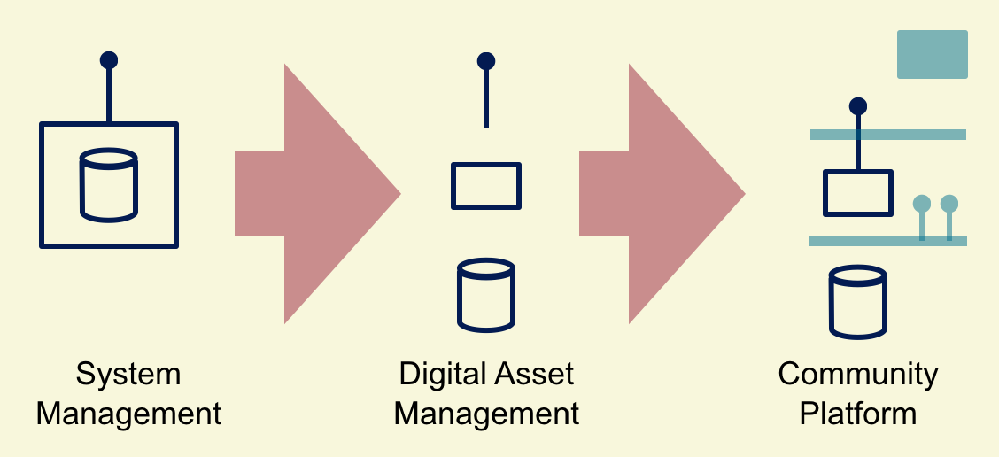

<pre class='metadata'>
Title: cloud.gov.dk introduktion
Status: LD
URL: https://github.com/digst/cloud/blob/master/intro.md
Editor: Mads Hjorth, Digitaliseringsstyrelsen http://arkitektur.digst.dk
  Christian Fahrenkrug, Statens IT
Boilerplate: table-of-contents no, copyright no, conformance no, abstract no
Markup Shorthands: biblio yes
Repository: digst/cloud
Inline Github Issues: full
</pre>
<h1>Introduktion,  GovCloud PaaS,  Statens IT</h1>

<small>
Dette dokument er del af serie af dokumenter der beskriver et samarbejde mellem SIT, DIGST og DMI, som startede med en aftale om <a href="https://digst.github.io/cloud/start.html">GovCloud</a>. Serien består af en <a href="https://digst.github.io/cloud/intro.html">introduktion</a> (dette dokument), en detaljeret <a href="https://digst.github.io/cloud/spec.html"> specifikation</a> samt en <a href="https://digst.github.io/cloud/guide.html">guide</a> til applikationsudviklere.</small>
  

Statens ITs nye cloudbaserede servicemodel, bringer jer et stort skridt tættere på at kunne opfylde målsætningerne i den fællesoffentlige digitaliseringsstrategi, og understøtter at jeres data kan gøres tilgængelig på tværs af applikationer, og er fritstillet ved fremtidige opgraderinger af jeres applikationer.

<h2 class="no-num">Indledning</h2>
Danmark er et digitalt samfund med høje ambitioner for sammenhængende services for borgere og virksomheder. Digitaliseringsstrategiens initiativer understøtter disse ambitioner, men flere myndigheder oplever at tilvejebringelsen af nye løsninger tager uforholdsmæssigt lang tid, særligt når flere myndigheder involveres.

Det nuværende niveau for offentlig IT har væsentlige udfordringer. Usammenhængende services leveret i siloer giver en ineffektiv datadeling der koster tid og penge samt hæmmer effektiv, data-drevet styring. Den manglende modenhed ved datadeling giver utilstrækkelig sikkerhed til at imødekomme nye trusler og gør det svært at leve op til borgernes forventninger til offentlige it-services. En lang række af de tekniske udfordringer der holder offentlige services tilbage kan løftes ved at anvende en cloudservice.

Ved at gøre brug af det endnu uforløste potentiale i cloudteknologien tager jeres organisation et væsentligt skridt mod lavere omkostninger og langt højere skalerbarhed end traditionelle udviklings- og driftmiljøer kan tilbyde. Hos Statens ITs cloudservice får i rammerne for en moderne dev-ops organisation der kan håndtere effektiv udvikling, test og deployment. 

Statens ITs Cloud service er en fælles platform der hjælper offentlige myndigheder med at overskue, opbevare, udvikle og køre applikationer og data. Regnekraft og opbevaringsplads deles mellem brugere af clouden, og alle betaler kun for det de selv bruger. Det betyder at man kan deles om regnekraften og opbevaringspladsen, så man kun skal betale for de nødvendige ressourcer, når man bruger dem. - Hvis der er behov for mere end Statens ITs egne maskiner kan levere, så kan systemet automatisk trække på andre cloudservere efter behov. Det giver effektiv udnyttelse af ressourcer på tværs af myndigheder.

<h2 class="no-num">Moderne IT forvaltning</h2>

Moderne systemforvaltning har en række velkendte udfordringer. Mange af dem udspringer af, at de forskellige dele af et samlet system, bør forvaltes på forskellige måder, da services, applikationer og data ikke har lige lang levetid. Derfor kræver de styring der rækker ud over levetiden for det system de er en del af.

Det betyder at systemforvaltning i dag, er forvaltning af digitale værdier (Digital Asset Management) der kan sættes sammen til at løfte specifikker services, og genbruges til at sikre sammenhæng og delt viden på tværs. Statens ITs cloudservice er opbygget efter en arkitektur der understøtter en sammenhængende forvaltning af adskilte digitale værdier, så de kan bruges i endnu flere sammensætninger.

Cloud Platform som enabler, by design. Men det skal styres gennem arkitektur for at undgå vendor lock-in.

<h2 class="no-num">Cloud</h2>
Ordet cloud er blevet del af dagligdagssproget og dækker over alt lige fra "just someone else's computer" til datacentre der bruger over en tiendedel af den samlede danske el-produktion. Her anvender vi markedets mest udbredte betydning som den kan findes hos det amerikanske National Institute of Standards and Technologies. De har udgivet en kort og præcis beskrivelse af en række begreber omkring cloud computing services:

<blockquote cite="">The NIST definition provides a unifying view of five essential characteristics that all cloud services exhibit: *ondemand self-service*, *broad network access*, *resource pooling*, *rapid elasticity*, and *measured service*. [...] It provides three service models available to cloud consumers: cloud software as a service (*SaaS*), cloud platform as a service (*PaaS*), and cloud infrastructure as a service (*IaaS*). [And] describes how the computing infrastructure that delivers these services can be shared: *private cloud*, *community cloud*, *public cloud*, and *hybrid cloud*.
<footer><cite>[[NIST.SP.500-292]]</cite></footer></blockquote>

Nye roller:
  - Cloudconsumer = Statslige organisationer, DIG!
  - Cloudprovider = ??
  - Audit, Broker og Carrier... er lidt uden for scope lige nu...

<h2 class="no-num">DIGST policy</h2>
Strategi eksisterende...Sammenhængende sikre og effektive services..

Anvendere ønsker at fokusere på den forretningsnære del af it-udviklingen (Står det i strategien?)

FDA: Byg efter fælles retningslinjer... brugerstyring, selvbetjening og datadistribution. Ny? Cloud first?.

Ny taktik: Compliance by design. Samle mange krav til én vejledning.

DIGST tror essentielle egeneskaber ved cloud computing vi bidrage væsentligt til den hastighed hvormed løsning udvikles og forbedres.

DIGST tror på fælles retningslinjer giver flytbare applikationer, mindre risiko for vendor login og effektiv overholdelse af retningslinjer.

*Paas* fordi...

*Community* fordi...

*Statens IT* fordi...

I øvrigt en gammel taktik: Effektiv implementering gennem central løsning med exit, e.g. Dankort.

*Hybrid cloud* på langsigt, måske med Statens IT som cloudbroker

Så GovCloud er vision om at Statens IT tilbyder en fælles platform til udvikling og drift af applikationer. Platformen er designet til effektiv overholdelse af fællesoffentlige retningslinjer og general lovgivning, og samtidig understøtte hyppige ændringer, øget datadeling og sammenhængende services (integrated service delivery in public sector).

<h2 class="no-num">GovCloud PaaS</h2>
Formålet tilbyde hyppigere ændringer gennem selvbetjening, lavere omkostninger ved ensartede modeller og understøtte compliance gennem platform design.

Compliance by design! og hyppig, effektiv udbredelse...på til harmoniserede services..

Placering af roller...

Myndigheder bliver cloud consumers, mere specifikt platformsanvendere

SIT bliver cloud provider, mere specifikt platformsudbyder

DIGT er policy owner, mere specifikt ansvarlig for retningsslinjer for anvendelsen af platformen og life cycle management of platform services.

Borger og virksomheder er busines service consumers

SIT genbruger
- Kundesupport/kontakt
- Faciliteter
- Sikkerhedsfunktioner
- Brugerstyring

I fremtiden.... Audit, Broker og Carrier....

<h2 class="no-num">Behov og der opfyldelse</h2>
Så

- Anvendere ønsker mere fleksibel og billigere adgang til it-ressourcer - Self-service, measured service (), ressource pooling og fælles indkøb, leverandør kendskab.

- Anvendere ønsker at kunne teste og idriftsætte nye versioner hurtigst muligt. - Self-service,

- Anvender ønsker sig sikkerhed for compliance... regulation and policy understøttelse
  - Sikkerheds (ISO27001)
  - Privacy GDPR
  - FDA principles supported/enforces by a layered architecture/seperation of conserns. Seperate functionality to manage user, share data and provide self-service from core business applications

- Anvender ønsker sig indflydele på platformens udvikling. - Fælles offentlig governance

- Anvender ønsker sig en fremtidssikring af løsninger... - Effektivt understøtte emerging principper som once-only, open by default, single digital gateway, reusable infrastructure... government data platform/datastrategi.

<h2 class="no-num">Mulige gevinster</h2>

<h2 class="no-num">Anvarsfordeling</h2>
PaaS beskriver ansvarsfordelinger:

<blockquote cite="">
Kunden får mulighed for at deploye egne applikationer der er udviklet med brug af programmeringssprog, services og værktøj der understøttes af SIT.

Kunden har ingen kontrol over den underlæggende infrastruktur, herunder network, serverer, operativsystemer og storage. Men tilgengæld over egne applikationer og deres konfigurationer.
<footer><cite>[[NIST.SP.800-145]]</cite></footer></blockquote>

Ansvarsfordelingen mellem platform og applikationer kan være flydende, men fastlægges i service model og life cycle management af API.

<h3 class="no-num">Myndighedens it-system(er)</h3>

<h4 class="no-num">Service</h4>
An Application Service represents an explicitly defined exposed application behaviour.

Eksempel: CPR opslag, Send Digital Post, Website

Rette mod Borger og Virksomheder (herunder andre myndigheder).

<h4 class="no-num">Applikation</h4>
An Application represents an encapsulation of application (business!) functionality

Process understøttelse.. hvor der også indgår borger og virksomhed, kun gennem services..

Minus data.

Eksempel: F2, Datafordeler, NemID,

Komponent unit of scalability

<h4 class="no-num">Datasamling</h4>

Eksempel: CVR register, HR Sager,

<h3 class="no-num">Statens ITs platform</h3>

<h4 class="no-num">Selvbetjening</h4>

<h4 class="no-num">Platform Services</h4>

<h4 class="no-num">Application Fabric</h4>

<h4 class="no-num">Data Fabric</h4>

<h3 class="no-num">Digitaliseringsstyrelsen</h3>

<h4 class="no-num">Roadmap for Platform Services</h4>

<h4 class="no-num">Vejledning i anvendelse</h4>

<pre class=biblio>
 {
 	"NIST.SP.800-145": {
 		"authors": [
 			"Peter Mell",
 			"Timothy Grance"
 		],
 		"href": "https://doi.org/10.6028/NIST.SP.800-145",
 		"title": "The NIST Definition of Cloud Computing",
 		"publisher": "National Institute of Standards and Technologies"
 	}
 }

{
 "NIST.SP.500-292": {
   "authors": [
   "Fang Liu", "Jin Tong", "Jian Mao", "Robert Bohn",
"John Messina", "Lee Badger2, "Dawn Leaf"
   ],
   "href": "https://doi.org/10.6028/NIST.SP.500-292",
   "title": "NIST Cloud Computing Reference Architecture",
   "publisher": "National Institute of Standards and Technologies"
 }
}

 </pre>
