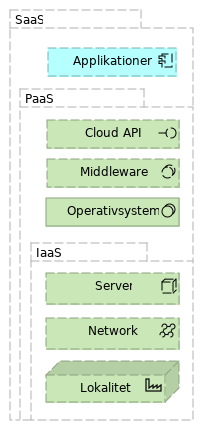

<pre class='metadata'>
Title: cloud.gov.dk introduktion
Status: LD
URL: http://github.com/digst/cloud/intro.md
Editor: Mads Hjorth, Digitaliseringsstyrelsen http://arkitektur.digst.dk
Boilerplate: table-of-contents no, copyright no, conformance no, abstract no
Markup Shorthands: biblio yes
Repository: digst/cloud
Inline Github Issues: full
</pre>
<h1>Introduktion,  GovCloud PaaS,  Statens IT</h1>

<small>
Dette dokument er del af serie af dokumenter der beskriver et samarbejde mellem SIT, DIGST og DMI, som startede med en aftale om <a href="http://htmlpreview.github.io/?https://github.com/digst/cloud/blob/master/start.html">GovCloud</a>. Serien består desuden af en <a href="http://htmlpreview.github.io/?https://github.com/digst/cloud/blob/master/intro.html">introduktion</a>, en detaljeret <a href="http://htmlpreview.github.io/?https://github.com/digst/cloud/blob/master/spec.html"> specifikation</a> samt en <a href="http://htmlpreview.github.io/?https://github.com/digst/cloud/blob/master/guide.html">guide</a> til applikationsudviklere.</small>

<h2 class="no-num">Indledning</h2>
Danmark er et digitalt samfund med høje ambitioner for sammenhængende services for borgere og virksomheder og ambitionerne løftes endnu engang med Regeringens Sammenhængsreforms delaftale om <a href="">Digital service i verdensklasse</a>.

I dag tilbydes mange offentlige services af enkelte myndigheder og er sjældent integreret i de sammenhængende brugeroplevelser som er en del af ambitionen. Selvom Digitaliseringsstrategiens initiativer peger i den rigtige retning oplever flere myndigheder at tilvejebringelsen af nye løsninger tager uforholdsmæssigt lang tid, særligt når flere myndigheder involveres. Leverandører og enkelte myndigheder har gode erfaringer med nedbringe tiden ved at bruge moderne udviklingsmetoder og cloud-teknologier.

En fælles government cloud er en måde at bringe nye metoder og teknologier i spil på, der tilbyder en ny sikker og mere effektiv platform for en ny generation af offentlige it-systemer.

Med Statens ITs beslutning om at tilbyde en Platform as a Service med sigte på at skabe den fremtidige fortrukne platform for IT i staten er vi ét skridt tættere på at kunne opfylde de høje digitale ambitioner.

Nuværende niveau for offentlig IT har væsentlige mangler
  - usammenhængende services leveret i siloer
  - ineffektiv datadeling koster og hæmmer effektiv, data-drevet styring
  - utilstrækkelig sikkerhed til at imødekomme ny trusler

Cloud-teknologier har uforløste potentialer
  - moderne drift er ved lave omkostninger og høj skalerbarhed
  - dev-ops giver effektiv udvikling, test og deployment
  - scale out til public cloud ved behov

Fælles platform giver nye muligheder
  - bedre overblik over værdier i form af data og applikationer
  - lettere genbrug af data i nye sammenhænge
  - effektiv udnyttelse af computerressourcer på tværs af myndigheder

<h2 class="no-num">Cloud</h2>
Ordet cloud er blevet del af dagligdagssproget for mange og dækker over alt lige fra "just someone else's computer" til datacentre der bruger over en tiendedel af den samlede danske el-produktion. Her anvender vi markedets mest udbredte betydning som den kan findes hos det amerikanske National Institute of Standards and Technologies. De har udgivet en kort og præcis beskrivelse af en række begreber omkring cloud computing services. [[NIST.SP.800-145]]

This cloud model is composed of five essential characteristics (On-demand self-service, Broad network access, Resource pooling, Rapid elasticity, Measured service), three service models (Software as a Service, Platform as a Service, Infrastructure as Services), and four deployment models (Private, Community, Public, Hybrid). ,

Og er blevet populært særligt på grund af developer agility and attractive (initial) cost.

<h2 class="no-num">GovCloud</h2>

GovCloud er en udviklings- og driftsmiljø der tilbydes af Statens IT som Platform as a Service. I første omgang  Community Cloud, men forventes udvidet til en Hybrid Cloud med anvendelse af andre Public Cloud og SIT som Cloud Broker. [[]]
SIT som provider, kunder som consumers. PaaS beskriver ansvarsfordelinger: Kunden får mulighed for at deploye egne applikationer der er udviklet med brug af programmeringssprog, services og værktøj der understøttes af SIT.

Kunden har ingen kontrol over den underlæggende infrastruktur, herunder network, serverer, operativsystemer og storage. Men tilgengæld over egne applikationer og deres konfigurationer.

Beskrivelse af stadig flydende ansvarsfordelingen mellem platform og applikationer. Men det fastlægges her...

GovCloud API aftales mellem kunder, SIT og DIGST som policy owner (own definition).

GovCloud API realiseres gennem middleware og custom build platformservices.

Note: Tegning1 layers, and middleware on one side, selfservice on the other. Tuborg... der folder middleware ud. ,

<h2 class="no-num">Fordele</h2>

Cloud karakteristika men også Complaince as a Service

FDA principles supported/enforces by a layered architecture/seperation of conserns.
- Externalise User Management
- Manage Data seperately from Applications

Senere....

Security (ISO27001)

Privacy (GDPR)

Procurement (SKI)
- Kompentancer

<h2 class="no-num">Services, applikationer og datasamlinger</h2>
Digital Asset Management. En hovedtype af assets for hvert lag i arkitekturen:

### Service
An Application Service represents an explicitly defined exposed application behaviour.

Eksempel: CPR opslag, Send Digital Post, Website

### Applikation
An Application represents an encapsulation of application functionality

Eksempel: F2, Datafordeler, NemID,

Komponent unit of scalability

### Datasamling

Eksempel: CVR register, HR Sager,

Note: Tegning2 med hegn/barriere og ternet jordstykke, service, grænsebomme.... SIT blå, kunde rød ,

<h2 class="no-num">Containere</h2>
Metafor: En container er en .exe fil....

Lag...base image

Bygge manifest...

Test manifest...

Scanning. [NIST](https://csrc.nist.gov/CSRC/media/Publications/sp/800-180/draft/documents/sp800-180_draft.pdf)

Note: Tegning3 af container, baseimage, lagerplads med labels og scanner...

<h2 class="no-num">Platformservices</h2>

Skal anvendes af applikationsudviklere. Bliver løbende udbygget og prioriteret

- Authorisation, men ikke authentication.  Genkende brugere... externt Anonyme services, identitetsbaseret services Godkende adgang internt i application. ABAC over RBAC Aka service... Identity broker....

- Brugerstyring API Key Management

- Log Log fra tre lag... mulighed for identifikationer.... Tegning af streams.

- Directory

- Container Repository

<h2 class="no-num">Other Software (as a Service)</h2>

Note: Tegning4 af SaaS søjler oven på PaaS. Og der løbende kommer mere til....

Playbook ideen.

### GovDev

### GovOpenData

### GovWeb

### GovAI

### GovData

<pre class=biblio>
 {
 	"NIST.SP.800-145": {
 		"authors": [
 			"Peter Mell",
 			"Timothy Grance"
 		],
 		"href": "https://doi.org/10.6028/NIST.SP.800-145",
 		"title": "The NIST Definition of Cloud Computing",
 		"publisher": "National Institute of Standards and Technologies"
 	}
 }

{
 "NIST.SP.500-292": {
   "authors": [
   "Fang Liu", "Jin Tong", "Jian Mao", "Robert Bohn",
"John Messina", "Lee Badger2, "Dawn Leaf"
   ],
   "href": "https://doi.org/10.6028/NIST.SP.500-292",
   "title": "NIST Cloud Computing Reference Architecture",
   "publisher": "National Institute of Standards and Technologies"
 }
}

 </pre>
