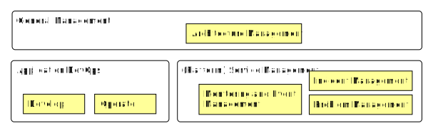

<pre class='metadata'>
Title: cloud.gov.dk spec
Status: LD
URL: http://github.com/digst/cloud/spec.md
Editor: Mads Hjorth, Digitaliseringsstyrelsen http://arkitektur.digst.dk
Abstract: Beskrivelse af implementeringen af GovCloud PaaS.
Boilerplate: copyright no, conformance no, Abstract no
Shortname: spec
Markup Shorthands: markdown yes
Repository: digst/cloud
Inline Github Issues: full
Logo: https://digst.github.io/cloud/cloud.svg
</pre>

<h1>Specifikation   GovCloud PaaS   Statens IT</h1>

<small>
Dette dokument er del af serie af dokumenter der beskriver et samarbejde mellem SIT, DIGST og DMI, som startede med en aftale om <a href="https://digst.github.io/cloud/start.html">GovCloud</a>. Serien består desuden af en <a href="https://digst.github.io/cloud/intro.html">introduktion</a>, en detaljeret <a href="https://digst.github.io/cloud/spec.html"> specifikation</a> samt en <a href="https://digst.github.io/cloud/guide.html">guide</a> til applikationsudviklere.</small>

<h2 class="no-num">Introduction</h2>

## Background

## High Level Description

## Epics and User Stories
Se excel.... backlog her...?

### Performance og Optimering

* Som udvikler og udbyder vil jeg kende applikations performance profil på platform, og kunne se hvor tiden bliver brugt, så bruger ressourcer fair og effektivt.

### Sharing, Sikring og Privacy

* Som anvender ønsker jeg at udbyder scanner mine applikationer for sårbarheder.

* Som anvender ønsker jeg at kunne give adgang til data for andre anvenderes applikationer, så jeg kan dele data uden at skulle udvikle en service. [Sikkerheds epic?]

* Sikkerhedsmodel

### Compliance

* Overblik over ISO 27001 kontrollere

* Overblik over GDPR aftaler, rettigheder og pligter

* Som policy owner... ekstern IdP, så vi sikre overholdelse af anbefalinger.

* Som policy owner... om selvbetjening? og datadeling?

* Digital Asset management

* Dokumentation af applikationer

### Audit / Erfaring
* Tilsyn...
* Security Audit
* Privacy Audit
* Performance Audit

# Motivation

Skal vi ikke have nogle drivers / outcomes med? og nogle stakeholders?

Måske bare tegne et lille UML shared use case diagram?

## Principles

Continuous Services, Vendor neutrality, High Scaleability, Security-by-design, GDPR-by-design, DevOps and Predictable Cost.

## Governing Thoughts....

Architectural consequences:

**Enterprise Grade Products**, to support high scaleability with predictable cost.

**Open Source supported interfaces**, to support  vendor neutrality and predictable cost.

**Self-Service (and automation)**, to support Continous Services, High Scaleability and DevOps.

Layered architecture (each layer scale idependently and different governance processes for: Data, Application and Access)

One platform? (staging on the same platform, run on dev laptop, integrated automated test, multiple versions of same service, active-active)

Services, Applications and Dataset!

And supporting services.... some for developers and some for applications (API).

Pure Archimate ... vi har valgt at sætte lighedstegn mellem platform of technology og lade kunders applikationer være blå. Det gør det muligt at synliggøre ansvarsfordelingen mellem platform og applikations som beskrevet i driftsmodellen (PaaS).

# Business

## Aktører og Business Collaboration

### Anvender

Cloud Consumer NIST
<blockquote cite="https://doi.org/10.6028/NIST.SP.500-292">
A cloud consumer represents a person or organization that maintains a business relationship with, and uses the service from a cloud provider.
</blockquote>

### Udbyder

Cloud Provider NIST
<blockquote cite="https://doi.org/10.6028/NIST.SP.500-292">
A cloud provider is a person, an organization; it is the entity responsible for making a service available to interested parties. A Cloud Provider acquires and manages the computing infrastructure required for providing the services, runs the cloud software that provides the services, and makes arrangement to deliver the cloud services to the Cloud Consumers through network access.
</blockquote>

### Policy Owner

<blockquote cite="http://www.form-online.dk/opgavenoegle/06/#06.38.10">
De overordnede rammer for digitaliseringen af samfundet, herunder tværgående arkitektur, offentlige data og it-standarder</blockquote>

### General Management
ITIL 4
(Platform Service Delivery)

* Architecture Management

<blockquote cite="https://wiki.en.it-processmaps.com/index.php/IT_Architecture_Management">
IT Architecture Management process aims to define a blueprint for the future development of the technological landscape, taking into account the service strategy and newly available technologies.
</blockquote>

### Application Development and Operation

<blockquote cite="https://en.wikipedia.org/wiki/DevOps">
DevOps is a set of software development practices that combine software development (Dev) and information technology operations (Ops) to shorten the systems development life cycle while delivering features, fixes, and updates frequently in close alignment with business objectives.
</blockquote>

### (Platform) Service Management
ITIL 4

* Monitoring and Event Management
<blockquote cite="">
ITIL 4
</blockquote>

* Incident Management
<blockquote cite="">
ITIL 4
</blockquote>

* Problem Management
<blockquote cite="">
ITIL 4
</blockquote>

### Future collaborations

* Audit?

## Security and Multitenancy

- Applications are responsible for implementing access policies to data at row level
- Access policies should rely on trusted attributes over detailes rights when possible.

## Business Processes and Functions
Vi har identificerewt en række arbejdsgange. Her beskrives de i Archimate notation og vi forklarer hvordan de anvender de forskellige komponenter overfor. Under etableringen af platformen er arbejdsgange blevet væsentlig simplere og en lang række skridt er blevet fundet overflødige.

### Registrer ny applikation

### Deploy applikation (Ops)

### Byg container (Dev)

### Test applikation
(Hvorfor er der ikke noget testmiljø? Fordi kunden selv etablere forskellige applikationer, der kan anvende samme containere og datasæt til forskellige formål)

### Give medarbejder adgang til platformsapplikationer
(eksisterende arbejdsgang. tilknytte B/X nummer til gruppe i AD)

### Register Application
Rancher installation. K8S ressources. Bør formentlig flyttes til en SIT branded selvbetjeningsløsning med få felter... som danner en passende yaml fil, som opbevares i Directory.

### Register Dataset
Oprettes manuelt på MapR. Bør formentlig flyttes til en SIT branded selvbetjeningsløsning med få felter... Fællesoffentlige DCAT/ADMS profil, som opbevares i Directory (og kan udstilles i Datasætkatalog)

### Register Service
Rancher installation. K8S ressources. Bør formentlig flyttes til en SIT branded selvbetjeningsløsning med få felter... som danner en passende servicebeskrivelse, som opbevares i Directory.

Udviklere kan registrere services på platformen. En service er en ressource på access fabric og er en forbindelse mellem et endpoint synligt udefra og et endpoint udstillet af en application på kubernetes.

### Redeploy Application
Rancher Installation. Bør formentlig være en simple knap på Dashboardet.

### Sandbox

SIT provides limited unsupported free-of-charge GovCloud ressources to existing and prospect consumers for evaluation purposes.

Whitelist af mail domæner, re-activation efter 14 dage på samme mail... eller anden (medarbejderen stopper, udvikleren fortsætter).

Implementeres som et 'one-node' image af CloudAPI der kan spindes op ved hjælp af OpenStack eller hentes hjem til lokalt kunde miljø.

Bør kunne laves med tilpasning af Ansible scripts der anvendes til installation af platformen.

### Collaboration
SIT provides collaborative tools to support collaboration during normal operation and during incident handling.

# Application (Cloud Consumer)
(Alt det med blåt.... Application Layer, <a href="http://pubs.opengroup.org/architecture/archimate3-doc/chap09.html#_Toc489946063">Archimate</a>)

## Application Service (and Interface)

<blockquote cite="http://pubs.opengroup.org/architecture/archimate3-doc/chap09.html#_Toc489946068">
An application interface represents a point of access where application services are made available to a user, another application component, or a node.
</blockquote>

<blockquote cite="http://pubs.opengroup.org/architecture/archimate3-doc/chap09.html#_Toc489946075">
An application service represents an explicitly defined exposed application behavior.
</blockquote>

## Application (Component)
<blockquote cite="http://pubs.opengroup.org/architecture/archimate3-doc/chap09.html#_Toc489946066">
An application component represents an encapsulation of application functionality aligned to implementation structure, which is modular and replaceable. It encapsulates its behavior and data, exposes services, and makes them available through interfaces.
</blockquote>

## Container

<blockquote cite="https://docs.docker.com/glossary/?term=container">
A container is a runtime instance of a docker image.
</blockquote>

## Dataset

<blockquote cite="https://arkitektur.digst.dk/sites/default/files/20180503_rad_v1.0_-_godkendt_af_sda.pdf">
en samling af oplysninger bestående af enkelte dele der forvaltes under et
</blockquote>

## Source Code

## Images
<blockquote cite="https://docs.docker.com/glossary/?term=image">
Docker images are the basis of containers. An Image is an ordered collection of root filesystem changes and the corresponding execution parameters for use within a container runtime. An image typically contains a union of layered filesystems stacked on top of each other. An image does not have state and it never changes.</blockquote>

## Tags
<blockquote cite="https://docs.docker.com/glossary/?term=tag">
A tag is a label applied to a Docker image in a repository. Tags are how various images in a repository are distinguished from each other.
</blockquote>

A tag is a label applied to a Docker image in a repository. Tags are how various images in a repository are distinguished from each other.

# Technology (Platform Provider)

(Alt det med Grønt (og gråt).... Technology Layer,
<a href="http://pubs.opengroup.org/architecture/archimate3-doc/chap10.html#_Toc489946081">Archimate</a>

## Fabrics...

### Service Fabric
Responsibilities:
- Oversæt ID og tildel requestID
- Adgangspolitik (Bruger/Service -> Service)
- Throttle/circuit breaker
- Log (AccessLog/Request Log?)

### Application Fabrics
Responsibilities:
- Deploy, scale, redeploy images from Repository
- Provide Configuration Environment
- Ingress/Service Discovery
- Network (...?)
- Mount NFS as Volume (for app log?)

### Data Fabric
Responsible for:
- Store datasets
- Authenticate access to inividual dataset per user/application/service
- Protect datasets against hardware failure at disk, machine and location level.
- Log of all dataoperations
- Implement dataaccess interfaces: File (NFS), Stream (Kafka), Document (OJAI), Table?

## Platform API
alle webservices der kan kaldes inde fra anvenderens applikationer.

Adgangskontrol til data via rettigheder i directory/registry.

Dataservices...

### `/file` (NFS)

### `/table` (NoSQL)

### `/stream` (Kafka)

### `/ldap` (Opslag i directory)

### `/log`
platformen skriver fra application services og dataservices.

anvenders applikations skriver også...

sammenstille, søge og hente

- All operations on datasets are logged into one datalog stream (Log4J specification needed!), and later split on a per customer base.

### `/token`
Oversætte id-tokens fra ekstern IdP. Måske oversætte til interne id'er. JWT?

!Authentication Findes ikke på platformen men sker hos IdP. Federation til Directory. Fx... binde NemId sammen med B-numre.

## Platform Services
alle med brugergenkendelse gennem SIT AD.

Web applikationer i browsere til brug for ansatte og konsulenter hos platformsanvender.

### `git.govcloud.dk`

### `reg.govcloud.dk`

### `k8s.govcloud.dk` (portal.)

### `status.govcloud.dk`

og noget med `<kunde>.status.govcloud.dk`

### `collab?.govcloud.dk`

## Middleware

### Gravitee

### Rancher
[Rancher](https://rancher.com/) has been choosen as Kubernetes Cluster Management, for the following reasons: Multitenancy build in, API access suitable for building SIT branded self-service, possible to resuse existing user interface elementes, multi-cluster capabilities, plans provding simple OS and ease of use for platform operation.

The mapping from business objects to Rancher elements are:

- Each SIT Customer is given one Rancher Project.

- Each Customer Application is given one Kubernetes Namespace in Rancher

- Each Customer (Application) Service is a Rancher Load Balancing Workload (Ingress)

and identities are stored in the Directory service.

K8S Service Network Tildeles pods automatisk...

Ingress controller bruger adresserne til loadbalancing mellem instanser.
<pre>
kube-pods-subnet : XXX.XXX.XXX.XXX
</pre>

Environment variablesApps finder datasservices via  environment variable

Note: Hvad peger de (table, stream, file?) på? Ip-adresser, DNS, virtuelle adresser?

### MapR

- Linux
- Hardware

- Initially MapR uses one Topology (clusters of identical hardware, identical OS)
- Update zones, Connectivity Zones??
- One cluser across multiple location.
- The `mapr` user should not use default name, UID and GUID.
- Run as non-root?
- Access to the MapR Control System is done through a Linux PAM connected to the central Directory using regular administrative SIT user accounts. (OpenLDAP?)
- Load Balancing using MapR Gateways? (L7, L3-4?, Locations?, Common endpoints across locations)

Note: Dual 10Gb NIC with trunking has been suggested. Would give more bandwidth, but also allow for moving without loosing network connection...

A dataset is a collection of individual pieces of information under the same governance. (pending definition/translation)

- Each customer has its own MapR Volume and is Data Responsible (Controller)i for all data stored.
- Each Dataset are stored in seperate sub-volumes and can have multiple representations (file, table, stream).
- Datasets are given an identity in the central Directory (mapping Dxxxxx to MapR path, storing access rights and ADMS metadata).
- Access to MapR volumes are given to [Application]s and [User]s in the central Directory. (Or should it really be Images?)
- Datasets are encrypted at rest (what keys? control?)

(Er det mulig at bruge symlinks til at referere til datasæts via både FORM, CVR )

### KeyCloak

### FreeIPA
Product with OpenLDAP interface. Data opbevares uden for MapR, men findes i kopi på MapR. Oplysninger om Kunder og Bruger hentes fra SIT AD.

Derudover gemmes identiteter og oplysninger om Applikationer, Services, Datasæt (D-numre) og rettigheder imellem disse og Kunder og Brugere.

Rettigheder anvendes af MapR og af Access Fabric.

Oplysninger om henholdvis services, applikationer og datasæt modelleres efter de fælles offentlige modeller herfor (se data.gov.dk).

Overvej ikke at gøre for mange felter obligatoriske fra starten. Lad kunne vedligeholde oplysninger gennem selvbetjening og uden om (ex excel). Custom felter? Henvisninger til stereotyper fra Referencearkitekturer.

- Each Application exposes Application Services through the use of LoadBalancers.
- Application Services are given an identity in the central Directory (mapping Sxxxxx to Applications, storing access rights and metadata).
- (consequence that all application services have access to same datasets?)

### GitLab

GitLab installation. Bør kører som applikation i K8S med AD integration og opbevare code som datasæt på MapR. Kræver vist in SQL database som skal installeres sammen med. Helm?

### Habor
Harbor installation. Bør kører som applikation i K8S med AD integration og opbevare containere som datasæt på MapR.

# Infrastructure
Vi beskriver netværket som det ser ud når man ankommer fra internettet....

Vi skal understøtte rolling updates og location failures samtidigt. Eventuelt tegning af L1/L2 og update gruppe A/B. Pointen er at der skal være nok maskiner med nok services i alle fire grupper til at kunne køre selvstændigt.

## Internet Network Access
GovCloud tilgås via kundens egen DNS record, der peger på ét fælles SIT kontrollet domæne, der peger på ét fast IP nummer hos Statens IT.

<pre>
cloud.gov.dk.		3589	IN	A	188.64.157.76
</pre>

Kunder sætter selv DNS CNAME op. Bør være til cloud.gov.dk og ikke ip

<pre>
api.kunde.example.com.		3589	IN	CNAME	cloud.gov.dk
</pre>

Note: kunden kan ikke bruge samme domæne til mail o.a. jf. RFC

Note: Er der trust-relaterede opsætninger i DNS der skal udføres? dnssec? dmarc?

Note: Hvor skal kunden registrere sine servicenavne? Skal vi anbefale SIT?

Note: Overveje hvordan det fælles certifikat kan genbruges til kundedomæner. (https/hostname).

## Gateway

Vi regner med der er Intrusion Protection Service mellem internettet og platformen.

Note: Vi vælger at F5 da vi ikke ønsker at scripte oprettelse af kundedomæner til den. Og da vi ikke ønsker den er ingress controller og indgang til alle øvrige services.

Note: How do we repport usage? Metering: Undersøg om der findes eksisterende overvågning. Vi kan 'nøjes' med per hostname.

Note: Monitoriering. Snak om ping/trace og kalde ned i stakken.

## Network Layout

### Application Network
Det primære netværk til App fabric dvs. K8S og den ingress controllers, men også loadbalancer ned mod MapR gateways.

Netværket er `vlanXX, 10.aaa.xxx.0/24`

men er yderligere delt op i en række subnet der anvendes til forskellige funktioner, og dermed også kan anvendes til afgrænsninger af trafik i firewallen.

* `10.aaa.xxx.0/28` noder der fungere som gateway og loadbalancer. I starten som manulet opsatte, men kan på sigt være ingress nodes der kontrolleres af K8S.

* `10.aaa.xxx.16/??` de primære applikationsnoder hvor pods afvikles af K8S.

* `10.aaa.xxx.248/29` noder der fungere som loadbalancer ned mod datafabric.

### Data Network
Det primære netværk til Data Fabric dvs hvor MapR kører.

Netværket er `vlanXX, 10.bbb.yyy.0/23`

Alle maskiner har et netværkskort på to subnet, så vi kan skille internt MapR chatter fra adgang til data.

* `10.bbb.yyy.0/24` noder der kører MapR's dataservices: Kafka, OJAI og NFS.

* `10.bbb.zzz.0/24` alle MapR noder.

### Firewall
For at kontrollere trafikken mellem internettet og de to netværk, samt mellem de foskellige funktioner, anvendes følgende firewall regler.

1. Tillad forbindelse fra internettet til gateway for http og https, så applikationer kan anvendes af kunder, borger og virksomheder `188.64.157.76:80,443 -> 10.aaa.xxx.3`

2. Tillad forbindelse fra loadbalancer noder til nfs, ojai og kafka på MapR, så applikationer kan hente og skrive data
`10.aaa.xxx.248/29:2049,8243,5678,8083,8082 -> 10.bbb.yyy.0/24`

3. Tillad forbindelse fra applikationer til internettet, så kunders applikationer kan anvendes services på internettet.
`10.aaa.xxx.16/?? -> any`

4. Tillad forbindelse fra MapR til enkelte applikationsnoder, der kører en proxy, så der kan hentes opdateringer og måske noget med at tjekke licenser. `10.bbb.zzz.0/24 -> 10.aaa.xxx.16/??`

### Remote admin access
Beskytte med certifikater...

admin på app cluster og admin på data cluster er to roller med hver deres certifikater.

Eksterne professionel services skal anvende remote desktop med overvågning fra SIT medarbejder.

## Hardware

<h2 class="no-num">Appendix</h2>

## Inspiration

### Kundens It-miljø

Kunden er en offentlig myndighed - som mange andre - med et mangeartet it-system-landskab fordelt på mange teknologi hos mange leverandører.

DevOps og Cloud teknologi

Fælles platform...

Arkitekturstil...

Realiseret... og selvbetjening.

24/7 Platform support. Applikationssupport...

### Tekniske kompetancer

* Udvikling af container baserede applikationer fx Docker.
* Anvendelse af asynkrone meddelelser som integration mellem applikationskomponenter fx Apace Kafka.
* Anvendelse af NoSQL dokumentdatabaser fx OJAI.
* Udvikling af HTTP services der følger REST.
* Token baseret adgangskontrol fx JWT.

## Use of Archimate

AXELOS (2019). "5.1 General management practices". ITIL Foundation, ITIL 4 edition. TSO (The Stationery Office). ISBN 978-0113316076.
^ AXELOS (2019). "5.2 Service management practices". ITIL Foundation, ITIL 4 edition. TSO (The Stationery Office). ISBN 978-0113316076.
^ AXELOS (2019). "5.3 Technical management practices". ITIL Foundation, ITIL 4 edition. TSO (The Stationery Office). ISBN 978-0113316076.
