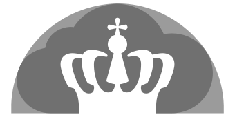
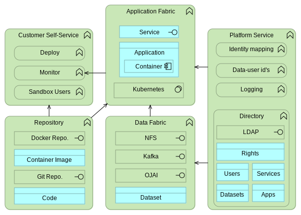
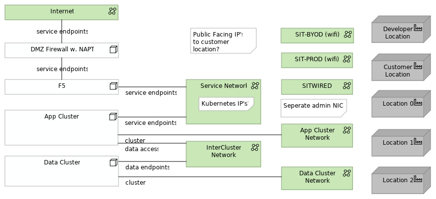
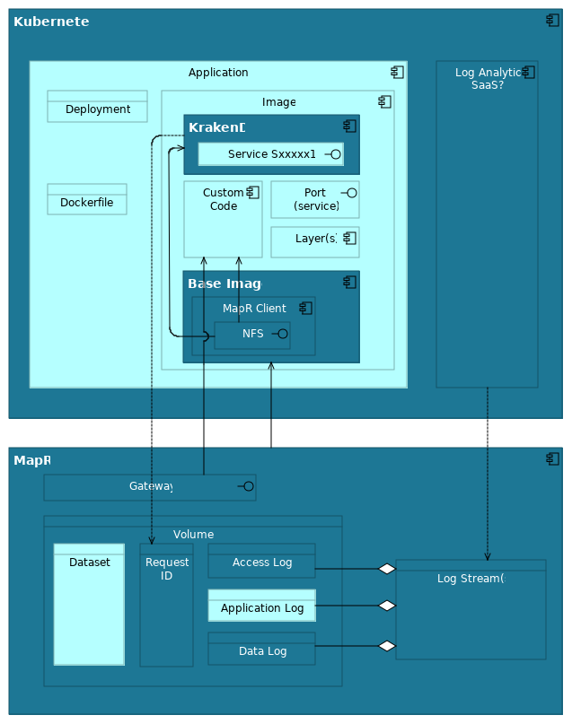
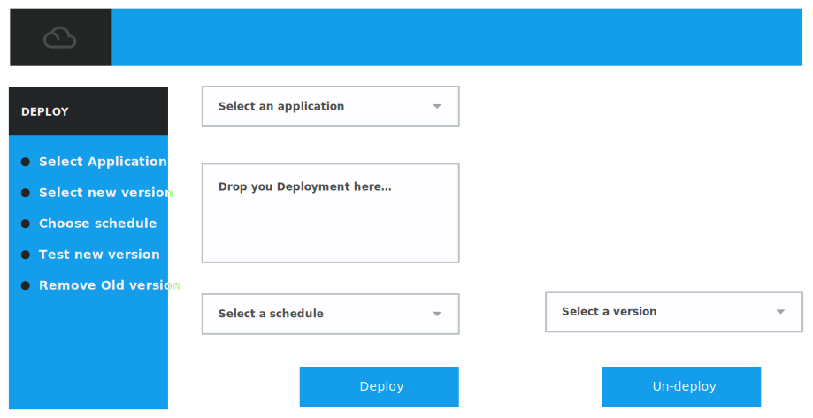
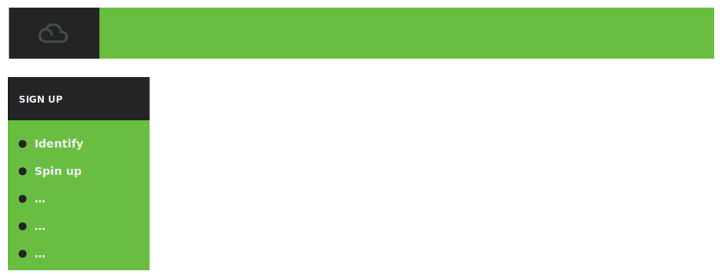

<pre class='metadata'>
Title: cloud.gov.dk spec
Status: LD
URL: http://github.com/digst/cloud/spec.md
Editor: Mads Hjorth, Digitaliseringsstyrelsen http://arkitektur.digst.dk
  Jan Nørgaard Jacobsen, Statens IT http://www.sit.dk
  Chris Gadegaard, Statens IT http://www.sit.dk
Abstract: A living specification of GovCloud PaaS middleware.
Boilerplate: copyright no, conformance no, abstract no
Repository: digst/cloud
Inline Github Issues: full
</pre>

<h1>Specifikation   GovCloud PaaS   Statens IT</h1>

<small>
Dette dokument er del af serie af dokumenter der beskriver et samarbejde mellem SIT, DIGST og DMI, som startede med en aftale om <a href="http://htmlpreview.github.io/?https://github.com/digst/cloud/blob/master/start.html">GovCloud</a>. Serien består desuden af en <a href="http://htmlpreview.github.io/?https://github.com/digst/cloud/blob/master/intro.html">introduktion</a>, en detaljeret <a href="http://htmlpreview.github.io/?https://github.com/digst/cloud/blob/master/spec.html"> specifikation</a> samt en <a href="http://htmlpreview.github.io/?https://github.com/digst/cloud/blob/master/guide.html">guide</a> til applikationsudviklere.</small>

<h2 class="no-num">Introduction</h1>

## User Stories
The version 1.0 of the GovCloud PaaS (primo 2019) is builded to support the following user stories:

Få nye brugere på....

Kommer med noget kode...
- As provider I want to onboard new customers
- As provider I want to re-deploy applications in a rolling fashion (ala rancher)
Vedligehold base image

## Principles and Governing Thoughts....

Continuous Services, Vendor neutrality, High Scaleability, Security-by-design, GDPR-by-design, DevOps and Predictable Cost.

Architectural consequences:

**Enterprise Grade Products**, to support high scaleability with predictable cost.

**Open Source supported interfaces**, to support  vendor neutrality and predictable cost.

**Self-Service (and automation)**, to support Continous Services, High Scaleability and DevOps.

Layered architecture (each layer scale idependently and different governance processes for: Data, Application and Access)

One platform? (staging on the same platform, run on dev laptop, integrated automated test, multiple versions of same service, active-active)

## High Level Architecture

<dfn>API Fabric</dfn> is...

<dfn>App Fabric</dfn> is...

<dfn>Data Fabric</dfn> is...

# Network

## Internet Network Access

### Endpoints
Tre faste IP numre

### DNS

<pre>
cloud.gov.dk -> xxx.xxx.xxx.xxx
</pre>

Kunder sætter selv DNS op... Bør være til cloud.gov.dk og ikke ip...

<pre>
api.kunde.dk -> cloud.gov.dk
</pre>

### Bandwith

### Monitoring
Service rapportering (Messured service, per app) og kapacitets.

### DDOS Protection

## NetOps

### Self-service
Nye applikationer og services kanb deployes af kunder uden at involvere SIT netværks afdeling.

### Infrastructure as code
Ligge i SIT Git...

VLAN oprettelse kan ske manuelt da det ikke

### Remote admin access
Beskytte med certifikater... admin på app cluster og admin på data cluster er to roller med hver deres certifikater.

## Layout

Flytte app cluster tæt på internettet... flytte data cluster ned i stakken.

### App Cluster Network
På tværs af lokaliteter. Primær IP til maskiner der kører Kubernetes.

Issue: Vælge om K8S system services skal kører her?
<pre>
kube-service-addresses : XXX.XXX.XXX.XXX
</pre>

#### Adgang fra internettet

Beskrivelse af hvordan det sker fra en laptop...

#### Adgang fra SIT-PROD

#### Adgang fra SIT-BYOD

### Data Cluster Network
På tværs af lokaliteter. Primær IP til maskiner der kører MapR.

#### Adgang fra internettet

Beskrivelse af hvordan det sker fra en laptop...

#### Adgang fra SIT-PROD

#### Adgang fra SIT-BYOD

### Service Network
Tildeles pods automatisk...

Ingress controller bruger adresserne til loadbalancing mellem instanser.
<pre>
kube-pods-subnet : XXX.XXX.XXX.XXX
</pre>
Issue: Choose IP range

Port range fra internettet?

### Intercluster Network (Data Access??)

#### DNS
Hvordan ser en App de forskellige MapR services?

# Data Fabric

Responsible for:
- Store datasets
- Authenticate access to inividual dataset per user/application/service
- Protect datasets against hardware failure at disk, machine and location level.
- Log of all dataoperations
- Implement dataaccess interfaces: File (NFS), Stream (Kafka), Document (OJAI), Table?

The data fabric is running latest version of [MapR](https://mapr.com/).

## MapR

### Node configuration
- Linux
- Hardware

- Initially MapR uses one Topology (clusters of identical hardware, identical OS)
- Update zones, Connectivity Zones??
- One cluser across multiple location.
- The `mapr` user should not use default name, UID and GUID.
- Run as non-root?
- Access to the MapR Control System is done through a Linux PAM connected to the central Directory using regular administrative SIT user accounts. (OpenLDAP?)
- Load Balancing using MapR Gateways? (L7, L3-4?, Locations?, Common endpoints across locations)

## Datasets

A <dfn>dataset</dfn> is a collection of individual pieces of information under the same governance. (pending definition/translation)

- Each customer has its own MapR Volume and is Data Responsible (Controller)i for all data stored.
- Each {{Dataset}} are stored in seperate sub-volumes and can have multiple representations (file, table, stream).
- Datasets are given an identity in the central Directory (mapping Dxxxxx to MapR path, storing access rights and ADMS metadata).
- Access to MapR volumes are given to [Application]s and [User]s in the central Directory. (Or should it really be Images?)
- Datasets are encrypted at rest (what keys? control?)

## Logs

- All operations on datasets are logged into one datalog stream (Log4J specification needed!), and later split on a per customer base.

# App Fabric

## Kubernetes
- The application management environment is the latest standalone version of [Kubernetes](https://kubernetes.io/).
- [Application]s are given an identity in the central Directory (Axxxxx, storing ownership, access rights and "Systembeskrivelser").
- Each Application is defined by a Kubernetes Deployment.
- Each Application exposes Application Services through the use of LoadBalancers.
- Application Services are given an identity in the central Directory (mapping Sxxxxx to Applications, storing access rights and metadata).
- (consequence that all application services have access to same datasets?)

Responsibilities:
- Deploy, scale, redeploy images from Repository
- Provide Configuration Environment
- Ingress/Service Discovery
- Network (...?)
- Mount NFS as Volume (for app log?)

## Docker
- The containarized application runtime environment is the latest version of [Docker](https://www.docker.com) supported by kubernetes.
- Docker [Images] are build using a common virtual image both in development and operation.
- All images are based on platform specific [Base Image].
- Each image exposed Image Services accesible only to other images in the same [Application].
- Each images implement a common schema for monitoring (should this be done at application level?)
- Each images implement a common schema for logging (should this be done at application level?)

## Base Image
- Linux afhænger af MapR
- MapR klient
- KrakenD
- Log til NFS (afprøve performance)
- App logger via stdout

<pre highlight="docker">
FROM docker:centos7

http://package.mapr.com/releases/v6.1.0/redhat/mapr-client-6.1.0.20180926230239.GA-1.x86_64.rpm

rpm -Uvh http://repo.krakend.io/rpm/krakend-repo-0.1-0.noarch.rpm

yum install -y krakend
systemctl start krakend
</pre>

Note: Missing HTTPS.... så vi skal nok hente lokalt og checksumme ...
# API Fabric

- The API Gateway is [KrakenD](http://www.krakend.io/).
- Access to Application

Responsibilities:

- Oversæt ID og tildel requestID
- Adgangspolitik (Bruger/Service -> Service)
- Throttle/circuit breaker
- Log (AccessLog/Request Log?)

## KrakenD

# Platform Services

## Authentication

**[Secure Token Service]** All services use a common secure token platform service.
**[Federation]** Authentication of end-users are done in federation.

## Authorization

**[Rights]** All access rights (end-users and other services) are given by service or data responsible to identities recognized by the secure token service. [Uklar]
**[Authorization]** Access policy on service level is enforced in Gateway, Access policy on data level in Service

## API Key Management
**[API Service]** Private users of Open Government Data on the GovCloud are registered with a API key.
**[API Keys]** Public Data Sharing is supported by a GovCloud platform service for API key management.

## Log

**[Log Service]** All services use a common logging service.

## Repository
Code and image...
**[Code service]** The code repository of applications and platform services is [GIT](https://git-scm.com/) and is a platform service at SIT.
**[Versioned Configuration]** SIT is using existing tools to maintain versions of configuration items used in the platform and in platform services.
**[Registry]** The artefact repository is [Docker Registry Server](https://docs.docker.com/registry/deploying/#use-an-insecure-registry-testing-only).

## Directory

**[Central Directory]** Users, Applications, Services and Dataset are ressources registered in the central directory service at SIT.

# Additional Software as a Service

## GovDev

### Build/Test Self-service

### Deploy Self-service

**[Gov Dev Tool]** SIT offers an enterprise grade 'Government Development Toolchain' as Software-as-a-Service to support agile application development.
**[Consumer Tool]** GovCloud Consumers may choose between using SIT’s SaaS toolchain and providing their own toolchain, contingent on the Consumer’s toolchain’s complete integration with the build and test processes from SIT.

## Sandbox

**[Sandbox]** SIT provides limited unsupported free-of-charge GovCloud ressources to existing and prospect consumers for evaluation purposes.

## Collaboration
**[SharedOperation]** SIT provides collaborative tools to support collaboration during normal operation and during incident handling.

## GovAI
...

# Customer Applications and their responsibilities
- Applications are responsible for implementing access policies to data at row level
- Access policies should rely on trusted attributes over detailes rights when possible.

[Application]: #application "A unit of governance"
<dfn>Dataset</dfn>: #dataset "A unit of governance"

[Log]: #datalog "A unit of governance"
  [Data Log]: #datalog "A unit of governance"
[Image]: #image "A unit of governance"
  [Base Image]: #image "A unit of governance"

[User]: #user "Physical person or Application instance outside the platform"

------------------

1. **[SysAdm tooling]** Operators at the Platform Provider choose tools suitable for automation and remote management based on individual experiences.
1. **[Test Image]** Automated test of services are done using a custom image maintained by SIT.
1. **[Acceptance test]** Service passing the provided automated tests are considered running.
1. **[Release]** Consumers label images in the repository for release based on test results.
1. **[Deploy]** In the initial version of the GovCloud PaaS releases of new versions of application services are done manually by SIT on request from the Cloud Consumer.
1. **[SLA management]** SIT is using existing tools and channels to provide data on the fullfillment of SLA and other agreements.
