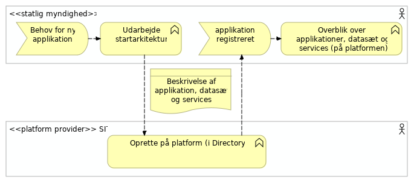
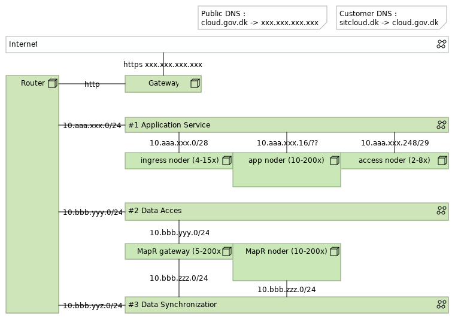
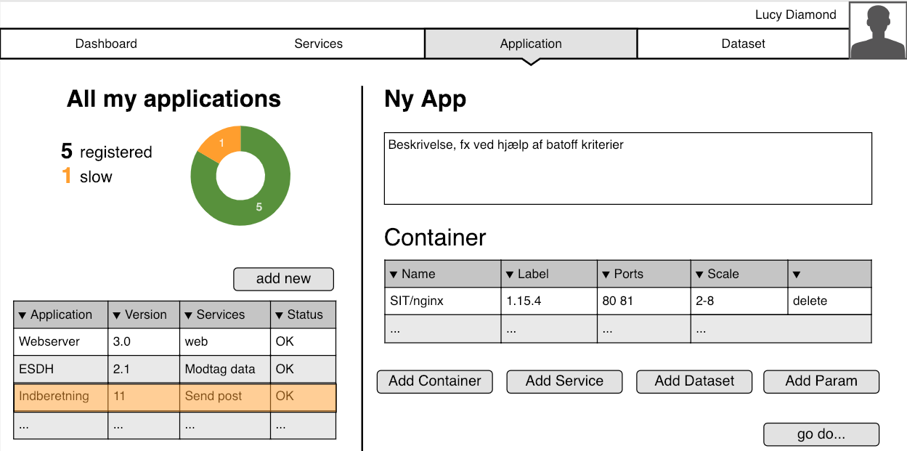
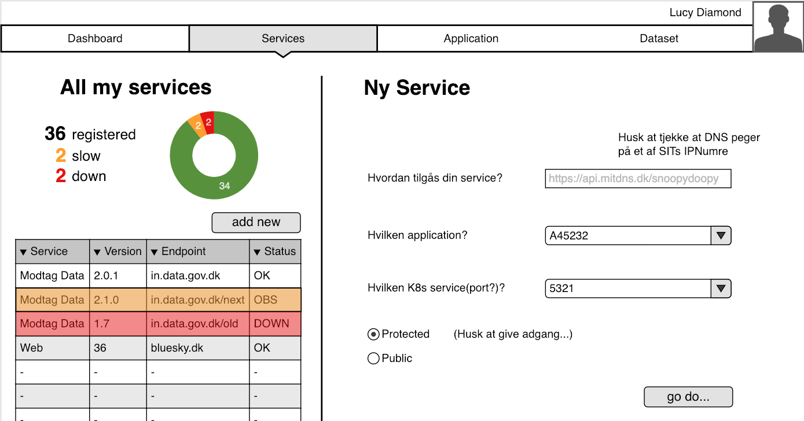
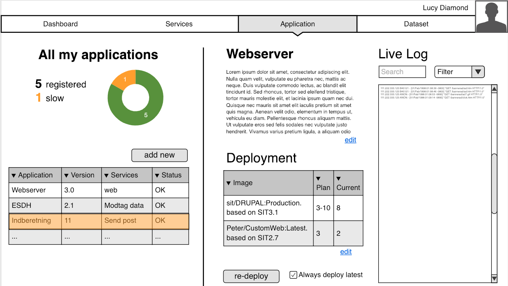

<pre class='metadata'>
Title: cloud.gov.dk spec
Status: LD
URL: http://github.com/digst/cloud/spec.md
Editor: Mads Hjorth, Digitaliseringsstyrelsen http://arkitektur.digst.dk
  Jan Nørgaard Jacobsen, Statens IT http://www.sit.dk
  Chris Gadegaard, Statens IT http://www.sit.dk
Abstract: Beskrivelse af implementeringen af GovCloud PaaS.
Boilerplate: copyright no, conformance no, Abstract no
Shortname: spec
Markup Shorthands: markdown yes
Repository: digst/cloud
Inline Github Issues: full
Logo: https://digst.github.io/cloud/cloud.svg
</pre>

<h1>Specifikation   GovCloud PaaS   Statens IT</h1>

<small>
Dette dokument er del af serie af dokumenter der beskriver et samarbejde mellem SIT, DIGST og DMI, som startede med en aftale om <a href="https://digst.github.io/cloud/start.html">GovCloud</a>. Serien består desuden af en <a href="https://digst.github.io/cloud/intro.html">introduktion</a>, en detaljeret <a href="https://digst.github.io/cloud/spec.html"> specifikation</a> samt en <a href="https://digst.github.io/cloud/guide.html">guide</a> til applikationsudviklere.</small>

<h2 class="no-num">Introduction</h2>

## User Stories
[bør nok flyttes til JIRA issues på et tidspunkt...]
For at fastholde og prioritere forskellige ønsker under udviklingen, anvender vi epics og user stories. I første omgang er aktørerne (Applikations-)udvikler, (Platforms)-operatør  og Policy Owner?

### Epics til understøttelse af "mennesker"

#### Kravspecifikation?
Når epic'en er færdig kan en kunde og en udvikler samarbejde om udarbejdelsen af epics, user stories, start arkitektur og andet i værktøj der kører på platformen. (Jira, Confluence)

#### Byg?
Når epic'en er færdig kan en udvikler checke kode ind og bygge en container med brug af værktøj på platformen. (git, docker)

* Som operatør vil jeg gerne kunne udgive et base image til brug for udviklere

#### Test?
Når epic'en er færdig kan en udvikler eller en operatør teste en containers funktionalitet med en række automatiske testcases.

#### Deploy og Monitorering?
Når epic'en er færdig kan en udvikler push'e en container til et repository på platformen, re-deploye en applikation og se dens log.

* Som udvikler ønsker jeg at kunne skrive 'docker push user/container' i en terminal for at sende min container til platformen. (labeling?) så jeg selv nemt kan styre hvilken kode der kører i min applikation.

* Som udvikler ønsker jeg at kunne starte et re-deploy af min applikation med specifikke version af containere (vha labeling), så jeg hurtigt kan ændrer funktionalitet i min applikation

* Som udvikler ønsker jeg at kunne se loggen fra mine deployments af applikationer, så jeg kan se om det lykkedes

* Som udvikler ønsker jeg at kunne se loggen fra mine kørende applikationer, så jeg kan sikre mig at den kører som forventligt eller jeg kan finde ud af hvorfor den ikke gør...

#### Sandbox
Når epic'en er færdig kan en SIT kunde oprette en midlertidig bruger til sin udvikler, som kan anvende MapR fra sine udvikler pc.

* Som udvikler, vil jeg kunne forbinde til en sandkasse MapR så jeg kan begynde at udvikle applikationer der anvender dataservices (stream, file, table) uden at skulle installere min egen MapR.

### Epics til understøttelse af "applikationer"

#### Dataservice Tabel (NoSQL/OJAI)

* Som operatør ønsker jeg at begrænse adgangen til datasæt til de brugere som kunden har give tilladelse til...

#### Dataservice Stream (Kafka)

#### Dataservice File (NFS)

* Som udvikler ønsker jeg skrive og læse filer fra min applikation.

### Version 1.0 primo 2019

Focus på Deploy og Monitorering så vi kan demonstrere time to market og hyppige ændringer...

Focus på platform Tabel-dataservice

Focus på Kubernetes og Services

### Version 1.1? marts 2019

### Version 1.2? juli 2019

## Principles and Governing Thoughts....

Continuous Services, Vendor neutrality, High Scaleability, Security-by-design, GDPR-by-design, DevOps and Predictable Cost.

Architectural consequences:

**Enterprise Grade Products**, to support high scaleability with predictable cost.

**Open Source supported interfaces**, to support  vendor neutrality and predictable cost.

**Self-Service (and automation)**, to support Continous Services, High Scaleability and DevOps.

Layered architecture (each layer scale idependently and different governance processes for: Data, Application and Access)

One platform? (staging on the same platform, run on dev laptop, integrated automated test, multiple versions of same service, active-active)

## High Level Architecture

<dfn>App Fabric</dfn> is...

<dfn>Data Fabric</dfn> is...

And supporting services.... some for developers and some for applications.

Pure Archimate ... vi har valgt at sætte lighedstegn mellem platform of technology og lade kunders applikationer være blå. Det gør det muligt at synliggøre ansvarsfordelingen mellem platform og applikations som beskrevet i driftsmodellen (PaaS).

# Arbejdsgange/Brugerrejser
Vi har identificerewt en række arbejdsgange. Her beskrives de som BPMN og vi forklarer hvordan de anvender de forskellige komponenter overfor. Under etableringen af platformen er arbejdsgange blevet væsentlig simplere og en lang række skridt er blevet fundet overflødige.

## Registrer ny applikation

## Deploy applikation (Ops)

## Byg container (Dev)

## Test applikation
(Hvorfor er der ikke noget testmiljø)

## Give medarbejder adgang til platformsapplikationer
(eksisterende arbejdsgang. tilknytte B/X nummer til gruppe i AD)

# API Fabric

- The API Gateway is [KrakenD](http://www.krakend.io/).
- Access to Application

Responsibilities:

- Oversæt ID og tildel requestID
- Adgangspolitik (Bruger/Service -> Service)
- Throttle/circuit breaker
- Log (AccessLog/Request Log?)

## KrakenD

# App Fabric

## Kubernetes
- The application management environment is the latest standalone version of [Kubernetes](https://kubernetes.io/).
- [Application]s are given an identity in the central Directory (Axxxxx, storing ownership, access rights and "Systembeskrivelser").
- Each Application is defined by a Kubernetes Deployment.
- Each Application exposes Application Services through the use of LoadBalancers.
- Application Services are given an identity in the central Directory (mapping Sxxxxx to Applications, storing access rights and metadata).
- (consequence that all application services have access to same datasets?)

Responsibilities:
- Deploy, scale, redeploy images from Repository
- Provide Configuration Environment
- Ingress/Service Discovery
- Network (...?)
- Mount NFS as Volume (for app log?)

### K8S Service Network
Tildeles pods automatisk...

Ingress controller bruger adresserne til loadbalancing mellem instanser.
<pre>
kube-pods-subnet : XXX.XXX.XXX.XXX
</pre>

### Environment variables
Apps finder datasservices via environment variable

Note: Hvad peger de (table, stream, file?) på? Ip-adresser, DNS, virtuelle adresser?

## Docker
- The containarized application runtime environment is the latest version of [Docker](https://www.docker.com) supported by kubernetes.
- Docker [Images] are build using a common virtual image both in development and operation.
- All images are based on platform specific [Base Image].
- Each image exposed Image Services accesible only to other images in the same [Application].
- Each images implement a common schema for monitoring (should this be done at application level?)
- Each images implement a common schema for logging (should this be done at application level?)

## Base Image
- Linux afhænger af MapR
- MapR klient
- KrakenD
- Log til NFS (afprøve performance)
- App logger via stdout

<pre highlight="docker">
FROM docker:centos7

http://package.mapr.com/releases/v6.1.0/redhat/mapr-client-6.1.0.20180926230239.GA-1.x86_64.rpm

rpm -Uvh http://repo.krakend.io/rpm/krakend-repo-0.1-0.noarch.rpm

yum install -y krakend
systemctl start krakend
</pre>

Note: Missing HTTPS.... så vi skal nok hente lokalt og checksumme ...

# Data Fabric

Responsible for:
- Store datasets
- Authenticate access to inividual dataset per user/application/service
- Protect datasets against hardware failure at disk, machine and location level.
- Log of all dataoperations
- Implement dataaccess interfaces: File (NFS), Stream (Kafka), Document (OJAI), Table?

The data fabric is running latest version of [MapR](https://mapr.com/).

## MapR

### Node configuration
- Linux
- Hardware

- Initially MapR uses one Topology (clusters of identical hardware, identical OS)
- Update zones, Connectivity Zones??
- One cluser across multiple location.
- The `mapr` user should not use default name, UID and GUID.
- Run as non-root?
- Access to the MapR Control System is done through a Linux PAM connected to the central Directory using regular administrative SIT user accounts. (OpenLDAP?)
- Load Balancing using MapR Gateways? (L7, L3-4?, Locations?, Common endpoints across locations)

Note: Dual 10Gb NIC with trunking has been suggested. Would give more bandwidth, but also allow for moving without loosing network connection...

## Datasets

A dataset is a collection of individual pieces of information under the same governance. (pending definition/translation)

- Each customer has its own MapR Volume and is Data Responsible (Controller)i for all data stored.
- Each Dataset are stored in seperate sub-volumes and can have multiple representations (file, table, stream).
- Datasets are given an identity in the central Directory (mapping Dxxxxx to MapR path, storing access rights and ADMS metadata).
- Access to MapR volumes are given to [Application]s and [User]s in the central Directory. (Or should it really be Images?)
- Datasets are encrypted at rest (what keys? control?)

## Logs

- All operations on datasets are logged into one datalog stream (Log4J specification needed!), and later split on a per customer base.

# Platform Services

## Authentication

**[Secure Token Service]** All services use a common secure token platform service.
**[Federation]** Authentication of end-users are done in federation.

## Authorization

**[Rights]** All access rights (end-users and other services) are given by service or data responsible to identities recognized by the secure token service. [Uklar]
**[Authorization]** Access policy on service level is enforced in Gateway, Access policy on data level in Service

## API Key Management
**[API Service]** Private users of Open Government Data on the GovCloud are registered with a API key.
**[API Keys]** Public Data Sharing is supported by a GovCloud platform service for API key management.

## Log

**[Log Service]** All services use a common logging service.

## Repository
Code and image...
**[Code service]** The code repository of applications and platform services is https://git-scm.com and is a platform service at SIT.
**[Versioned Configuration]** SIT is using existing tools to maintain versions of configuration items used in the platform and in platform services.
**[Registry]** The artefact repository is [Docker Registry Server](https://docs.docker.com/registry/deploying/#use-an-insecure-registry-testing-only).

## Directory

**[Central Directory]** Users, Applications, Services and Dataset are ressources registered in the central directory service at SIT.

## Forbrugsoverblik?

## Oprettelse af brugere til sandbox

## Adgang til MapR for sandbox services

# Infrastructure (Network)
Vi beskriver netværket som det ser ud når man ankommer fra internettet....

## Internet Network Access
GovCloud tilgås via et DNS opslag til et fast IP nummer hos Statens IT.

<pre>
cloud.gov.dk.		3589	IN	A	???.???.???.???
</pre>

Kunder sætter selv DNS CNAME op. Bør være til cloud.gov.dk og ikke ip

<pre>
api.kunde.example.com.		3589	IN	CNAME	cloud.gov.dk
</pre>

Note: kunden kan ikke bruge samme domæne til mail o.a. jf. RFC

Note: Er der trust-relaterede opsætninger i DNS der skal udføres? dnssec? dmarc?

Note: Hvor skal kunden registrere sine servicenavne? Skal vi anbefale SIT?

## Gateway

Vi regner med der er Intrusion Protection Service mellem internettet og platformen.

Note: Vi vælger at F5 fra og tager en simplere og mere direkte approach. Fordi vi vil have control over loadbalancing som sikre hurtigere patching.

Monitoring Vi starter på et TCP ping til cloud.gov.dk

Note: How do we repport usage? Metering: Undersøg om der findes eksisterende overvågning. Vi kan 'nøjes' med per hostname.

## Layout

### Application Services
Det primære netværk App fabric dvs. K8S og den ingress controllers.

Load rammer et udvalg af ip-numre
<pre>
vlanXX, 10.33.xxx.xxx/24
</pre>

### Data Access
Der hvor K8S kan hente data fra MapR via LoadBalancer

<pre>
vlanXX, 10.33.xxx.xxx/24
</pre>

### Data Synchronisation
Adgang til Loadbalancer fra K8S
Kan bruges til at styre trafik mod forskellige gateway nodes.
<pre>
vlanXX, 10.33.xxx.xxx/26
</pre>

### Firewall

<pre>
allow from 10.aaa.xxx.248/29
      to   10.bbb.yyy.0/24
</pre>

### Remote admin access
Beskytte med certifikater...

admin på app cluster og admin på data cluster er to roller med hver deres certifikater.

Eksterne professionel services skal anvende remote desktop med overvågning fra SIT medarbejder.

# Self-service (portal)

 Nedenstående mockups kan findes samlet <a href="https://app.moqups.com/mads.hjorth@gmail.com/PWwjFtF0KR/view">her.</a>

## Register Application

## Register Service

Udviklere kan registrere services på platformen. En service er en ressource på access fabric og er en forbindelse mellem et endpoint synligt udefra og et endpoint udstillet af en application på kubernetes.

## Redeploy Application

## Sandbox

SIT provides limited unsupported free-of-charge GovCloud ressources to existing and prospect consumers for evaluation purposes.

Whitelist af mail domæner, re-activation efter 14 dage på samme mail... eller anden (medarbejderen stopper, udvikleren fortsætter).

## Collaboration
**[SharedOperation]** SIT provides collaborative tools to support collaboration during normal operation and during incident handling.

## GovAI
...

# Customer Applications and their responsibilities
- Applications are responsible for implementing access policies to data at row level
- Access policies should rely on trusted attributes over detailes rights when possible.

## Use of Archimate

[Application]: #application "A unit of governance"
<dfn>Dataset</dfn>: #dataset "A unit of governance"

[Log]: #datalog "A unit of governance"
  [Data Log]: #datalog "A unit of governance"
[Image]: #image "A unit of governance"
  [Base Image]: #image "A unit of governance"

[User]: #user "Physical person or Application instance outside the platform"

------------------

1. **[SysAdm tooling]** Operators at the Platform Provider choose tools suitable for automation and remote management based on individual experiences.
1. **[Test Image]** Automated test of services are done using a custom image maintained by SIT.
1. **[Acceptance test]** Service passing the provided automated tests are considered running.
1. **[Release]** Consumers label images in the repository for release based on test results.
1. **[Deploy]** In the initial version of the GovCloud PaaS releases of new versions of application services are done manually by SIT on request from the Cloud Consumer.
1. **[SLA management]** SIT is using existing tools and channels to provide data on the fullfillment of SLA and other agreements.
