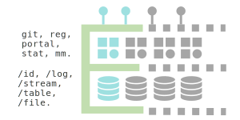
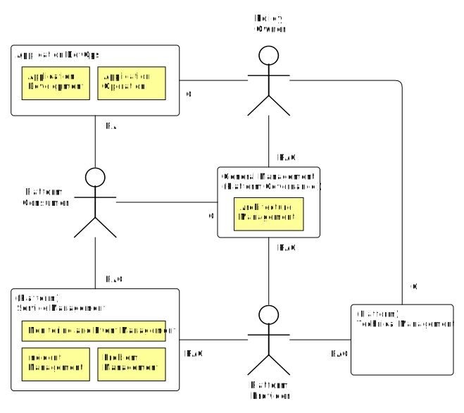

<pre class='metadata'>
Title: cloud.gov.dk spec
Status: LD
URL: http://github.com/digst/cloud/spec.md
Editor: Mads Hjorth, Digitaliseringsstyrelsen http://arkitektur.digst.dk
Abstract: Beskrivelse af implementeringen af GovCloud PaaS. Denne version skrives med henblik på godkendelse i styregruppe medio august 2019.
Boilerplate: copyright no, conformance no,
Shortname: spec
Markup Shorthands: markdown yes
Repository: digst/cloud
Inline Github Issues: full
Logo: https://digst.github.io/cloud/cloud.svg
</pre>

<h1>Specifikation   GovCloud PaaS   Statens IT</h1>

<h2 class="no-num">Introduction</h2>
<small>
Dette dokument er del af serie af dokumenter der beskriver et samarbejde mellem SIT, DIGST og DMI, som startede med en aftale om <a href="https://digst.github.io/cloud/start.html">GovCloud</a>. Serien består desuden af en <a href="https://digst.github.io/cloud/intro.html">introduktion</a>, en detaljeret <a href="https://digst.github.io/cloud/spec.html"> specifikation</a> samt en <a href="https://digst.github.io/cloud/guide.html">guide</a> til applikationsudviklere.</small>

 

# Motivation
God arkitektur er løsninger på et problem.

*Hvordan tager de offentlige bedst cloud-teknologier i brug?*

Denne arkitektur sigter mod at øge anvendelsen af data der registreres af offentlige myndigheder (formuleres som problem?).

(Hvilke assesments har vi? Disruption er sket...)

Effektiv it-udvikling, men det er næppe de direkte gevinster der er de vigtigste/største, it-udgifter er specielle, fordi hvis de bruges rigtige spares rigtig mange penge, men de kan også bruges på en måde der ikke giver meget værdi (fx flytte data rundt, fremfor at lave gode brugeroplevelser/hyppige tilpasninger)

Skal vi ikke have nogle drivers / outcomes med? og nogle stakeholders?

## Designprincipper

**Uafbrudte services** Platformen og dens applikationer er bygget med henblik på at understøtte uafbrudte services både under opdatering af enkelte services og hele platformen. Det betyder at der ikke eksisterer aftale service-vinduer, at services kan kører i forskellige versioner og infrastruktur og middleware etableres med hensyn til high-availability. Princippet følger tendenser med digital selvbetjening skal være tilgængelig 24/7 da brugere anvender dem på alle tider af døgnet og fra hele verden.

**Leverandøruafhængighed** Data, applikation og services på Platformen skal effektivt kunne flyttes til en anden cloud platform. Det betyder at teknologivalg og snitflader mellem komponenter skal nøje overvejes så bindinger til enkelt leverandører undgås. Fordi det er en fælles platform, er valget ikke op til den enkelte anvender, men træffes i fællesskab. Dette sikres gennem anvendelse af standardiserede snitflader, der understøttes af open source implementeringer.

**Skalérbar platform** Forvaltning, support og komponenter skal kunne håndtere mange applikationer med begrænset tilføjelse af ressourcer. Dette betyder at platform services realiseres gennem anvendelse af enterprise-grade komponenter med professional services-aftaler, at der tidligt i udviklingen er fokus på automatisering af daglige opgaver samt at platformen kan anvendes alene gennem selvbetjening uden involvering af udbyderen. Skalérbarheden giver ikke bare stordriftsfordele, men er en grundlæggende ændringer i opgavefordeling.

**GDPR-by-design** Platformen er forberedt til behandling af persondata og andre følsomme data i hht. [[!GDPR]]. Det betyder datasubjekters rettigheder og dataansvarliges pligter på sigt understøttes af fælles services. Princippet om privacy-by-design betyder at der tidligt i udviklingen indtænkes sikkerheds-kontroller og privacy-barriere, i form af tekniske service, men også i form af nye opgaver og ansvar. Fælles services kunne fx være overblik over anvendelse af persondata så vi sikre effektiv implementering af datasubjekter ret til indsigt. (ref. til digi.strategi?)

**Security-by-design** Platformen er designet på en måde der sikrer høj informationssikkerhed for applikationer og data, bl.a. ved kryptering af data, integreret brugerstyring og overvågning af netværkstrafik.
Særligt den såkaldte krigsregel betyder at særlige kristisk applikationer kan kræves at blive opbevaret på dansk territorie [[!DATALOV]]. Derfor opbevares applikationer og data indledningsvis alene hos og af SIT (on-premise), men senere kan udvalgte applikationer og data også driftes i eksterne driftsmiljøer (scale-out til public clouds).
Det betyder platformen på sigt tilbyder funktioner til at udfører den type af kontroller som er beskrevet i [[ISO27]] og understøttelse af effektiv information asset management som aftalt (hvem har besluttet anvendelse af 27001?). (ref. til cybersecurity?)

**Omkostningssikker** Platformens driftsmodel sikrer, at kunders omkostninger til platform-services er forudsigelige (som modsætning til eksisterende public cloud tilbud).

**Agil it-udvikling** Platformen og dens driftsmodel skal understøtte applikationsudvikling baseret på DevOps og Continuous Delivery.

## Arkitekturstil

Platformen skal understøtte moderner applikationer...

SOA (den modne udgave), 12 factor apps, Cloud, PaaS. API enabled GUI.

Platformen skal styre adskilles mellem services, applikationer og data... gennem Layered architecture. Fordi de har forskellige levetid og forvaltes meget forskelligt.

Converged infrastruktur, henvisning til factor 10

## Dokumentationstil

Platformen (og den applikationer) dokumenteres ensartet gennem brug af ure Archimate [[FDA]] ... vi har valgt at sætte lighedstegn mellem platform og technology.
Derfor er organisatorisk/forretning elementer gule, applikation blå og platform/teknologi grøn. Det gør det muligt at synliggøre ansvarsfordelingen mellem platform og applikations som beskrevet i driftsmodellen (PaaS). (Archimate er overaskende adapt når man tænker på det skabt i kontekst før cloud teknologi)

<blockquote cite="http://pubs.opengroup.org/architecture/archimate3-doc/chap03.html#_Toc489945969">
The ArchiMate core language defines a structure of generic elements and their relationships, which can be specialized in different layers. Three layers are defined within the ArchiMate core language as follows:
1.  The Business Layer depicts business services offered to customers, which are realized in the organization by business processes performed by business actors.
2.  The Application Layer depicts application services that support the business, and the applications that realize them.
3.  The Technology Layer depicts technology services such as processing, storage, and communication services needed to run the applications, and the computer and communication hardware and system software that realize those services. Physical elements are added for modeling physical equipment, materials, and distribution networks to this layer. [[ARCHI]]
</blockquote>

# Business
På et forretningsmæssigt niveau kan platformen kan beskrives i termer af roller og områder for samarbejde. Herunder beskrives de væsentligste opgaver, nemlig Arkitekturstyring, Applikationsudvikling og -drift, Overvågning og eventhåndtering, Hændelseshåndtering, Problemhåndtering samt Sikkerhed og ressourceafgrænsning. I nedenstående tegning bliver relationen mellem roller, samarbejdsområder og opgaver præsenteret. (Forklar RAC og hvorfor I ikke er med)
 

## Roller og områder for samarbejde

### <dfn export="true">Platformsudbyder</dfn>

*— virksomhed med ansvar for at stille en platformstjeneste til rådighed for andre interesserede virksomheder*

Statens IT er udbyder af denne platform, og er dermed ansvarlig for at forvalte den organisering, softwareinstallationer og fysiske infrastruktur, der tilsammen realiser platformstjenesten.

(Skal vi skrive noget om mulighederne for at være Cloud Broker?)

<blockquote cite="https://doi.org/10.6028/NIST.SP.500-292">
A cloud provider is a person, an organization; it is the entity responsible for making a service available to interested parties. A Cloud Provider acquires and manages the computing infrastructure required for providing the services, runs the cloud software that provides the services, and makes arrangement to deliver the cloud services to the Cloud Consumers through network access. [[NIST.SP.500-292]]
</blockquote>

### <dfn export="true">Platformsanvender</dfn>

*— virksomhed der indgår i en relation med, og anvender tjenester fra en platformsudbyder*

For denne platform gælder det mere specifikt at platformsanvenderen er en eksisterende kunde hos Statens IT og derfor oftest vil være en offentlig myndighed på statsligt niveau. Vi bruger termen virksomhed fremfor myndighed for at gøre det eksplicit at anvenderen er knyttet til det fælles offentlige virksomhedsbegreb, der anvendes i CVR.

<blockquote cite="https://doi.org/10.6028/NIST.SP.500-292">
A cloud consumer represents a person or organization that maintains a business relationship with, and uses the service from a cloud provider. [[NIST.SP.500-292]]
</blockquote>

### <dfn export="true">Policy-ansvarlig</dfn>

*— del af en organisation, der er ansvarlig for de overordnede rammer for udvikling og anvendelse af it*

Her er organisationen "det offentlige" eller "statslige myndigheder" og DIGST har rollen.

Note: (Kan vi finde bedre kilde en [[FORM]]?)

<blockquote cite="http://www.form-online.dk/opgavenoegle/06/#06.38.10">
De overordnede rammer for digitaliseringen af samfundet, herunder tværgående arkitektur, offentlige data og it-standarder [[FORM]]</blockquote>

## Opgaver

Som præsenteret i illustrationen i starten af afsnittet samarbejder rollerne om en række opgaver (eng. practices).

<blockquote>
In ITIL 4, practices are a set of organizational resources designed for performing work or accomplishing an objective. [[ITIL4]]
</blockquote>

Herunder har beskriver vi de væsentligste opgaver i forbindelse med udviklingen og drift af applikationsservices og den underliggende platform.

### <dfn export="true">Arkitekturstyring</dfn>

*—  forvaltningsopgave .... (tjek FDA)*

<blockquote cite="https://www.bmc.com/blogs/itil-management-practices/">
To provide an understanding of all the different elements that make up an organization and how those elements interrelate, enabling the organization to effectively achieve its current and future objectives. It provides the principles, standards, and tools that enable an organization to manage complex change in a structured and agile way. [[ITIL4]]
</blockquote>

Ansvaret for opgaven er delt mellem policy-ansvarlig og platformsudbyder. Policy-ansvarlig har ansvaret for beskrivelsen af den del af arkitekturen som er synlig for anvenderen dvs. platform services og platform api. Udbyderen har derimod ansvaret for den del af arkitketuren der realisere de beskrevne services og interfaces.

Policy-ansvarlig sikre at princippet om leverandøruafhængighed overholdes ved at basere platform services og api på modne og veletablerede specifikationer og standarder fx ved brug af CAMMS...

Udbyderen sikrer at princippet om uafbrudte services og skalérbarhed  overholdes ved at vælge middleware komponenter der er bedst egnet til formålet og passer til organisations øvrige teknologivalg og driftsmodeller.

### <dfn export="true">Applikationsudvikling og -drift</dfn>

<blockquote cite="https://en.wikipedia.org/wiki/DevOps">
DevOps is a set of software development practices that combine software development (Dev) and information technology operations (Ops) to shorten the systems development life cycle while delivering features, fixes, and updates frequently in close alignment with business objectives. [[ITIL4]]
</blockquote>

Anvenderen har ansvaret for udviklingen og anvendelsen af egne applikationer.

Policy-ansvarlig bidrager med vejledning til anvendelse af platformens services og api, og sikre applikationer er flytbare gennem at udvælge teknologier og snitflader (se <a>arkitekturstyring</a>).

### <dfn export="true">Statusovervågning</dfn>

Ansvaret for statusovervågning må deles mellem platformsudbyder og platformsanvender, da udbyder ikke kan vurdere hvilke kriterier der skal undersøges for at en applikationsservice er 'oppe'.

Platformsudbyder er ansvarlig for at overvåge status på platform services og API, samt stille services til rådighed for anvender til overvågning af dennes services.

I praksis betyder det at for hver applikationsservice registrerer anvender hvilke forespørgsler og svar der forventes af den normalt fungerende service (se monitor). Udbyder anvender denne information til automatisk at tjekke status på alle services og igangsætte hændelseshåndterings-processen ved ikke-normal status.

Statusovervågning resulter i rapporter om platformen og applikationers status der indgår i den almindelige styring (se general management).

<blockquote cite="https://www.bmc.com/blogs/itil-management-practices/">
To systematically observe services and service components, and record and report selected changes of state identified as events, through identifying and prioritizing infrastructure, services, business processes, and information security events, and establishing the appropriate response to those events, including responding to conditions that could lead to potential faults or incidents. [[ITIL4]]</blockquote>

### <dfn export="true">Hændelseshåndtering</dfn>
Formålet med opgaven er simple - at få applikations og platformsservices i normal drift så hurtigt som muligt efter utilsigtede hændelser. Ansvaret for opgave er derimod komplekst (uddyb? udbyder har ikke viden om anvenders applikationer)

Derfor har det være nødvendigt at aftale en eksplict proces (henvisning?, beskriv hvad vi ønsker at opnå med processen)

<blockquote cite="https://www.bmc.com/blogs/itil-management-practices/">
To minimize the negative impact of incidents by restoring normal service operation as quickly as possible.[[ITIL4]]
</blockquote>

Vigtigt at opsamle viden undervejs, derfor en særskilt samarbejdsplatform (se Collab). Både til brug for den generelle management, men også til problem-håndtering.

### <dfn export="true">Problemhåndtering</dfn>

Bemærk at dette er en seperat process... (se beskrivelse i ITIL)

<blockquote cite="https://www.bmc.com/blogs/itil-management-practices/">
To reduce the likelihood and impact of incidents by identifying actual and potential causes of incidents, and managing workarounds and known errors. [[ITIL4]]
</blockquote>

Resultater føres tilbage til anvender og udbyder, og til policy-owner, som kan tage højde for tidligere problemer i deres rådgivning om udvikling af applikationer på platformen.

### <dfn export="true">Sikkerhed og ressourcestyring</dfn>

Liste over risici [[NIST.SP.800-146]] og måder at imødegå dem på. (se forøvrigt listen over open issues...særligt 8-8)

The on-site private cloud scenario og PaaS using Scavenged Resources:.

**Data Protection** Piggy bag on excisting 27001?

**Browser-anvendelse** Brugeren af applikationsservices vil ofte anvende en webbrowser som klient til services fra mange udbydere. Derved risikere brugeren at ondsindede hjemmeside efterlader kode i form af fx plugins, cached javascript eller system services, som vil true fortroligheden af information fra andre hjemmesider.

En måde at imødegå dette på er at anvende én browser dedikeret til services brugeren har tillid til, og andre til browsere til det almindelige internet (Eventuelt browser med særlige indstillinger til fx tilladte algoritmer og accepterede rod-certifikater). Det kan eventuelt gøres med brug af virtuelle maskiner enten på sin egen maskine eller over en service. (skal vi nævne VIA?)

Særligt vigtig er fortroligheden af brugerens login-acredentials. Browsere vil tilbyde at opbevare dem for convinience. To-faktor login til tjenester hvor det er brug for høj fortrolighed.

Note: (Skal vi tilbyde det som option i service fabric? eller måske endda slå det til som default hvis applikationer har adgang til (person)følsomme data.)

**Netværk** Hverken anvender eller udbyder kan sikre internettet. Men vi kan lave boundary controllers (og skelne mellem SIT PROD og internettet). Selv indenfor er der brug for at sikre sig mod sniffing, så brug HTTPS. Og ha styr på certifikathåndtering og anbefalede algoritmer. Særligt med app-2-app forbindelser... men husk at ansvaret ligger hos dem der udstiller følsomme data

Note: Mangler vi anbefalinger om sikring af webservices?

**Isolation vs Effiency (Deling af instancer)**  Det er dyrt af have en server per client... så en applikationsservice services flere brugere. Særligt opmærksom på services der tillader adgang fra brugere fra flere platformsanvendere (shared services). Der kan fejl i applikationer føre til utilsigtet adgang til dataset.

Derfor reducere vi antallet af shared services med adgang til følsomme data og opfordrer til at applikationer deles på image niveau. Det vil sige samme applikationskode kan kører i mange instancer, men hver instance anvendes kun af anvendere inden for samme platformsanvender.

Desuden sikre udbyders logning af dataanvendelse af hvis fejl opstår fx i configuration og rettigheder, så er der sporbarhed og synlighed omkring hændelsen.

**Lack of portability**
NIST opfordring til anvendelse af generiske snitflader. Her er vi meget specifikke og siger kun adgang til data gennem standardiserede (og tilgængelige i open source implementeringer) snitflader. Og K8S/Docker.

**Eventbase process scheduling**
Det er svært at garantere tid og næppe muligt at kører realtidssystemer på delt hardware. Derfor bør platformen ikke anvendes til tidskritiske systemer. Vi vurdere at langt det meste af den offentlige forvaltning ikke er tidskritisk men kan leve med svartider der variere op til flere sekunder.

**Security Engineering**
(Særlig opgave med ansvar for adgang til de enkelte record i et data sæt... men vi tror PaaS er mere sikkert, fordi de begrænsede sikkerhedsressourcer får lov til at fokusere på det specifikke og det generelle håndteres på platform niveau)

- Access policies should rely on trusted attributes over detailes rights when possible.

- Acces policy enforcement and audit

**Secure Data Deletion**
Note: her mangler vi noget... og noget med Statens Arkiver...

**Security Risks from Multitenancy**
Der der er flere anvender af den samme fysiske infrastruktur er det vigtigt at sikre en fornødne afgrænsning af adgang til information og ressourcer (multitenancy).

- Applications (and Service and Datasets) are treated like first class tenants because different life spand and ownership changes over time. But always a clear owner (customer) to a tenant.

(Skal foldes helt ud...)

- Dataset lever laaaaang tid. Og kan være underlagt meget regulering.
- Services kan leve laaaang tid, men nogle har også brug for meget hyppige ændringer.
- Applikationer er der mere frit slag.. men huske at de måske ændrer ejerskab ved ressortomlægning.

### <dfn export="true">Ressource management</dfn>
Der der er flere anvender af den samme fysiske infrastruktur er det vigtigt at sikre en fornødne afgrænsning af adgang og ressourcer (multitenancy).

Network, Compute and Storage... per fabric.

Hard and soft limits? Max scale factor?

(Skal foldes  helt  ud...)

Udbyder kan ikke prioritere mellem anvendere, da de ikke kender kritikalitet... og selv på instruks har de ikke myndighed til at vælge.. så der skal bare være nok :-)

### <dfn export="true">Privacy?</dfn>
Med tiden vil der kommer mange datasæt. Og vi har eksplicit sænket barrierene for datadeling. Når der er nok datasæt skal vi til at tænke på at sætte benspænd op for sammenstilling af personfølsomme datasæt (profillering).

Vi ser personal id's som kernen og tror ikke på global ids.
Så på sigt vil vi have per datasæt id (at rest), per service/anvendelse id (in flight) og tredje part med service til sammenstilling af id (id correlation)... og anbefalinger om transient id's hvor det er muligt.

Forberede på måske at give datasubjekt ret til...?

## Arbejdsgange/Brugeroplevelser
På en række centrale områder adskiller brugeroplevelsen ved platformen sig væsentligt fra mere konventionel udvikling og drift af it.

### Registrere Applikationer, Datasamlinger og Services
Har til formål at sikre beskrivende felter til mange formål.

Opfordre til at der sker allerede i en start arkitketur... og vedligeholdes løbende i forbindelse med udvkling.

Especially Information, Software and Services from ISO 27001 Information Asset Inventory.

Fællesoffentlige DCAT/ADMS profil, som opbevares i Directory (og kan udstilles i Datasætkatalog)

Understøttes i selvbetjeningsløsning, der både registrere, men også opretter på platformen. Fx opretter (sub)volume i MapR eller placeholder på URL.

### DevOps
(Beskrive lidt om hvad opgaverne består i... måske relatere dem til services?)

* **Plan** Fastholde user stories og start arkitektur. Id'er på user stories til løbende status og kobling til code versioner. Måske allerede registrere dem (se ovenfor).
* **Code** Relisere user stories, branche..., versionere...
* **Build** from code to image.
* **Test** Validere succeskritierer, test individuelle images og deres samspil, på data der matcher kritierier. Gerne automatiseret.
* **Release** Sætte tags på images.
* **Deploy** Kan ske automatisk ved CI og tagging. Husk kriterier for monitoring.
* **Operate** Fx rettigheder til data
* **Monitor** Reagere på hændelser.... men også rapporter kpi'er

Samme miljø på tværs af dev, test og ops.. forklar.

### Collaborative Incident Management
Har til formål at få services op at kører.. men er kompleks fordi der både er en platform, en applikation og en status overvågning...

Det er også en del af Operate skridtet i <a>DevOps</a> ovenfor.

Beskriv det som en online samarbejdsøvelse...

SIT provides collaborative tools to support collaboration during normal operation and during incident handling.

### Toolchain
Ikke den del af PaaS, men samlet tilbud.

### Træning

SKI?

SIT provides limited unsupported free-of-charge GovCloud ressources to existing and prospect consumers for evaluation purposes.

Whitelist af mail domæner, re-activation efter 14 dage på samme mail... eller anden (medarbejderen stopper, udvikleren fortsætter).

Implementeres som et 'one-node' image af CloudAPI der kan spindes op ved hjælp af OpenStack eller hentes hjem til lokalt kunde miljø.

Bør kunne laves med tilpasning af Ansible scripts der anvendes til installation af platformen.

# Application

## Run time (find på bedre term)

### <dfn export="true">Applilkationstjeneste</dfn> (Tjek FDA)
I denne platform er en applikationstjeneste enten en konkret webapplikation eller en webservice som forvaltes af en platformanvender. Applikationstjenester er tilgængelig fra internettet via en URL og anvender typisk HTTPS som protokol og enten HTML eller XML/JSON som payload.

Applikationstjenester anvendes enten af medarbejder hos den enkelte myndighed eller af borger og virksomheder som en del af en offentlig opgave.

Det kunne fx være en hjemmeside med en selvbetjeningsløsning eller en webservice hvor man kan hente aktuelle vejrobservationer.

(Den forbruger ressourceer, netværk og kan derfor også begrænsees)

De overvåges

Anvender bestemmer adgangspolitik som håndhæves af platformsudbyder.

I følge 12 faktor er det REST så den kan skalere...

<blockquote cite="http://pubs.opengroup.org/architecture/archimate3-doc/chap09.html#_Toc489946068">
An application interface represents a point of access where application services are made available to a user, another application component, or a node.
</blockquote>

<blockquote cite="http://pubs.opengroup.org/architecture/archimate3-doc/chap09.html#_Toc489946075">
An application service represents an explicitly defined exposed application behavior.
</blockquote>

### <dfn export="true">Application/Deployment</dfn> (Tjek FDA og finde bedre term)

Det bliver til et namespace i rancher/k8s

### <dfn export="true">Container (Application Component)</dfn>

<blockquote cite="https://docs.docker.com/glossary/?term=container">
A container is a runtime instance of a docker image.
</blockquote>

(Den forbruger ressourceer, compute og kan derfor også begrænsees)

<blockquote cite="http://pubs.opengroup.org/architecture/archimate3-doc/chap09.html#_Toc489946066">
An application component represents an encapsulation of application functionality aligned to implementation structure, which is modular and replaceable. It encapsulates its behavior **and data**, exposes services, and makes them available through interfaces.
</blockquote>

Pointe om at den netop *ikke* har data inde i sig... Eller skal vi snakke Logic Component and Data Component?

### <dfn export="true">Dataset</dfn> (Tjek FDA)

(Den forbruger ressourceer, storage og kan derfor også begrænsees)

Den tilgås gennem standardiserede snitflader, bestemt gennem arkitektur styring. Men også gennem andre applikationers services.
<blockquote cite="https://arkitektur.digst.dk/sites/default/files/20180503_rad_v1.0_-_godkendt_af_sda.pdf">
en samling af oplysninger bestående af enkelte dele der forvaltes under et
</blockquote>

Note: Vi bruger ikke termen it-system... Hvis vi gjorde ville det omfatte alle de nødvendige dele for at realisere en Applikationstjeneste... og det er mange... inkl strømforsyning, tidsservere og mennesker...

### <dfn export="true">Logs</dfn>

Både fra de tre fabrics og fra applikationer.

## <dfn export="true">Repository</dfn>
Der hvor man opbevare det der bliver til it-systemer...

### <dfn export="true">Source Code</dfn>
Den kildekode og andre artifakter som anvendes til at bygge et image. Oftest skrevet i et programmeringssprog som Java eller Go, men kan også være grafikelementer, installationsscripts og andet.

Kildekoden findes ofte i flere samtidige branches og har tilknyttet version der opdateres ved ændringer og markering af releases, som er særlige version der fx er taget i brug eller blevet afprøvet.

En vigtig artifakt er configuration, men ikke secrets.

### <dfn export="true">Images</dfn>
er resultatet af et byg på baggrund af en version af kildekoden.

I docker er navngivet ejer/navn for at synliggøre ejerskabet.

Vi kan skanne dem for sårbarheder.

Note: Et namespace per platformsanvender/virksomhed?

<blockquote cite="https://docs.docker.com/glossary/?term=image">
Docker images are the basis of containers. An Image is an ordered collection of root filesystem changes and the corresponding execution parameters for use within a container runtime. An image typically contains a union of layered filesystems stacked on top of each other. An image does not have state and it never changes.</blockquote>

### <dfn export="true">Tags</dfn>
Et docker images kan tagges med flere tags.

De anvendes fx ved deployment, ejer/navn:prod

Note: Vi bør have anbefalinger for et fælles skema i udviklingshåndbogen.

<blockquote cite="https://docs.docker.com/glossary/?term=tag">
A tag is a label applied to a Docker image in a repository. Tags are how various images in a repository are distinguished from each other.
</blockquote>

## <dfn export="true">Directory/Inventory</dfn>
der hvor der er oplysninger om hvad der kører og hvem der har adgang til det...

### <dfn export="true">Oplysning om services</dfn>

### <dfn export="true">Oplysning om applikationer</dfn>

### <dfn export="true">Oplysning om datasæt</dfn>
Default til følsommes. Beskrive udfordringen mellem Open By Default og Privacy By Design... afhænger om indhold af persondata. 

### <dfn export="true">Users</dfn> (Personer, Brugere?)

### <dfn export="true">Rettigheder</dfn>

A,U -> S

A -(r,w)-> D

Pointe om at tjekke rettigheder i forhold til lovgivning automatisk. Indtaste hvilken hjemmel, pege på retsinformation, maskinlæsbare regler for (gen)-anvendelse.

# Technology

## Platform Services
alle med brugergenkendelse gennem SIT AD.

Web applikationer i browsere til brug for ansatte og konsulenter hos platformsanvender.

### `git.govcloud.dk`

### `reg.govcloud.dk`

### `k8s.govcloud.dk` (portal.)

Beskriv custom GUI

### `status.govcloud.dk`

og noget med `<kunde>.status.govcloud.dk`

### `collab?.govcloud.dk`

## Fabrics...

Det har et dashboard hver hvor de kan overvåges og driftes fra. Og provisioneres til.

Men det også et arkitekturlag... Der matcher digital assets.

Og det realiseres gennem platform komponenter og middleware.

### Service Fabric
Responsibilities:
- Oversæt ID og tildel requestID
- Adgangspolitik (Bruger/Service -> Service)
- Throttle/circuit breaker
- Log (AccessLog/Request Log?)

### Application Fabrics
Responsibilities:
- Deploy, scale, redeploy images from Repository
- Provide Configuration Environment
- Ingress/Service Discovery
- Network (...?)
- Mount NFS as Volume (for app log?)

### Data Fabric
Responsible for:
- Store datasets
- Authenticate access to inividual dataset per user/application/service
- Protect datasets against hardware failure at disk, machine and location level.
- Log of all dataoperations
- Implement dataaccess interfaces: File (NFS), Stream (Kafka), Document (OJAI), Table?

## Platform API
alle webservices der kan kaldes inde fra anvenderens applikationer.

Der er underlagt arkitekturstyring og bestemmes af Policy-owner.

Adgangskontrol til data via rettigheder i directory/registry.

Dataservices...

### `/file` (NFS)
Possix compliance... så man kan det samme som på UNIX og LINUX og Windows?

### `/table` (NoSQL)
Desværre ikke nogle standard (endnu).

Men kendetegnet ved Non-ACID. men tilgengæld skalerbar.

OJAI. Særligt interessant med store JSON dokumenter der kune låser den del af DOM der skrives i.

### `/stream` (Kafka)

### `/log`
platformen skriver fra application services og dataservices.

anvenders applikations skriver også...

sammenstille, søge og hente

- All operations on datasets are logged into one datalog stream (Log4J specification needed!), and later split on a per customer base.

Note: Vi mangler vejledning i hvordan Log skrives fx Log4J mønster, men gem det til udvikler håndbogen.

### `/token`
Oversætte id-tokens fra ekstern IdP. Måske oversætte til interne id'er. JWT?

Noget om SSO og STS og realms.

!Authentication Findes ikke på platformen men sker hos IdP. Federation til Directory. Fx... binde NemId sammen med B-numre.

Hvsd betyder det at man kan bruge eksisterende trusted attributes. Giv eksempel

## Middleware

### Gravitee

### Rancher
[Rancher](https://rancher.com/) has been choosen as Kubernetes Cluster Management, for the following reasons: Multitenancy build in, API access suitable for building SIT branded self-service, possible to resuse existing user interface elementes, multi-cluster capabilities, plans provding simple OS and ease of use for platform operation.

The mapping from business objects to Rancher elements are:

- Each SIT Customer is given one Rancher Project.

- Each Customer Application is given one Kubernetes Namespace in Rancher

- Each Customer (Application) Service is a Rancher Load Balancing Workload (Ingress)

and identities are stored in the Directory service.

K8S Service Network Tildeles pods automatisk...

Ingress controller bruger adresserne til loadbalancing mellem instanser.
<pre>
kube-pods-subnet : XXX.XXX.XXX.XXX
</pre>

Environment variablesApps finder datasservices via  environment variable

Note: Hvad peger de (table, stream, file?) på? Ip-adresser, DNS, virtuelle adresser?

Note: Er der adgang på API niveau udefra?

### MapR

- Linux
- Hardware

- Initially MapR uses one Topology (clusters of identical hardware, identical OS)
- Update zones, Connectivity Zones??
- One cluser across multiple location.
- The `mapr` user should not use default name, UID and GUID.
- Run as non-root?
- Access to the MapR Control System is done through a Linux PAM connected to the central Directory using regular administrative SIT user accounts. (OpenLDAP?)
- Load Balancing using MapR Gateways? (L7, L3-4?, Locations?, Common endpoints across locations)

Note: Dual 10Gb NIC with trunking has been suggested. Would give more bandwidth, but also allow for moving without loosing network connection...

A dataset is a collection of individual pieces of information under the same governance. (pending definition/translation)

- Each customer has its own MapR Volume and is Data Responsible (Controller)i for all data stored.
- Each Dataset are stored in seperate sub-volumes and can have multiple representations (file, table, stream).
- Datasets are given an identity in the central Directory (mapping Dxxxxx to MapR path, storing access rights and ADMS metadata).
- Access to MapR volumes are given to [Application]s and [User]s in the central Directory. (Or should it really be Images?)
- Datasets are encrypted at rest (what keys? control?)

(Er det mulig at bruge symlinks til at referere til datasæts via både FORM, CVR )

### KeyCloak

### FreeIPA
Product with LDAP interface. Data opbevares uden for MapR, men findes i kopi på MapR. Oplysninger om Kunder og Bruger hentes fra SIT AD.

Derudover gemmes identiteter og oplysninger om Applikationer, Services, Datasæt (D-numre) og rettigheder imellem disse og Kunder og Brugere.

Rettigheder anvendes af MapR og af Access Fabric.

Oplysninger om henholdvis services, applikationer og datasæt modelleres efter de fælles offentlige modeller herfor (se data.gov.dk).

Overvej ikke at gøre for mange felter obligatoriske fra starten. Lad kunne vedligeholde oplysninger gennem selvbetjening og uden om (ex excel). Custom felter? Henvisninger til stereotyper fra Referencearkitekturer.

- Each Application exposes Application Services through the use of LoadBalancers.
- Application Services are given an identity in the central Directory (mapping Sxxxxx to Applications, storing access rights and metadata).
- (consequence that all application services have access to same datasets?)

### GitLab

GitLab installation. Bør kører som applikation i K8S med AD integration og opbevare code som datasæt på MapR. Kræver vist in SQL database som skal installeres sammen med. Helm?

### Habor
Harbor installation. Bør kører som applikation i K8S med AD integration og opbevare containere som datasæt på MapR.

# Infrastructure
Vi beskriver netværket som det ser ud når man ankommer fra internettet....

Vi skal understøtte rolling updates og location failures samtidigt. Eventuelt tegning af L1/L2 og update gruppe A/B. Pointen er at der skal være nok maskiner med nok services i alle fire grupper til at kunne køre selvstændigt.

## Internet Network Access
GovCloud tilgås via kundens egen DNS record, der peger på ét fælles SIT kontrollet domæne, der peger på ét fast IP nummer hos Statens IT.

<pre>
cloud.gov.dk.		3589	IN	A	188.64.157.76
</pre>

Kunder sætter selv DNS CNAME op. Bør være til cloud.gov.dk og ikke ip

<pre>
api.kunde.example.com.		3589	IN	CNAME	cloud.gov.dk
</pre>

Note: kunden kan ikke bruge samme domæne til mail o.a. jf. RFC

Note: Er der trust-relaterede opsætninger i DNS der skal udføres? dnssec? dmarc?

Note: Hvor skal kunden registrere sine servicenavne? Skal vi anbefale SIT?

Note: Overveje hvordan det fælles certifikat kan genbruges til kundedomæner. (https/hostname).

## Gateway

Vi regner med der er Intrusion Protection Service mellem internettet og platformen.

Note: Vi vælger at F5 da vi ikke ønsker at scripte oprettelse af kundedomæner til den. Og da vi ikke ønsker den er ingress controller og indgang til alle øvrige services.

Note: How do we repport usage? Metering: Undersøg om der findes eksisterende overvågning. Vi kan 'nøjes' med per hostname.

Note: Monitoriering. Snak om ping/trace og kalde ned i stakken.

## Network Layout

### Application Network
Det primære netværk til App fabric dvs. K8S og den ingress controllers, men også loadbalancer ned mod MapR gateways.

Netværket er `vlanXX, 10.aaa.xxx.0/24`

men er yderligere delt op i en række subnet der anvendes til forskellige funktioner, og dermed også kan anvendes til afgrænsninger af trafik i firewallen.

* `10.aaa.xxx.0/28` noder der fungere som gateway og loadbalancer. I starten som manulet opsatte, men kan på sigt være ingress nodes der kontrolleres af K8S.

* `10.aaa.xxx.16/??` de primære applikationsnoder hvor pods afvikles af K8S.

* `10.aaa.xxx.248/29` noder der fungere som loadbalancer ned mod datafabric.

### Data Network
Det primære netværk til Data Fabric dvs hvor MapR kører.

Netværket er `vlanXX, 10.bbb.yyy.0/23`

Alle maskiner har et netværkskort på to subnet, så vi kan skille internt MapR chatter fra adgang til data.

* `10.bbb.yyy.0/24` noder der kører MapR's dataservices: Kafka, OJAI og NFS.

* `10.bbb.zzz.0/24` alle MapR noder.

### Firewall
For at kontrollere trafikken mellem internettet og de to netværk, samt mellem de foskellige funktioner, anvendes følgende firewall regler.

1. Tillad forbindelse fra internettet til gateway for http og https, så applikationer kan anvendes af kunder, borger og virksomheder `188.64.157.76:80,443 -> 10.aaa.xxx.3`

2. Tillad forbindelse fra loadbalancer noder til nfs, ojai og kafka på MapR, så applikationer kan hente og skrive data
`10.aaa.xxx.248/29:2049,8243,5678,8083,8082 -> 10.bbb.yyy.0/24`

3. Tillad forbindelse fra applikationer til internettet, så kunders applikationer kan anvendes services på internettet.
`10.aaa.xxx.16/?? -> any`

4. Tillad forbindelse fra MapR til enkelte applikationsnoder, der kører en proxy, så der kan hentes opdateringer og måske noget med at tjekke licenser. `10.bbb.zzz.0/24 -> 10.aaa.xxx.16/??`

### Remote admin access
Beskytte med certifikater...

admin på app cluster og admin på data cluster er to roller med hver deres certifikater.

Eksterne professionel services skal anvende remote desktop med overvågning fra SIT medarbejder.

## Hardware

<h2 class="no-num">Appendix</h2>

## Inspiration til udarbejdelse af kontrakter

### Kundens It-miljø

Kunden er en offentlig myndighed - som mange andre - med et mangeartet it-system-landskab fordelt på mange teknologi hos mange leverandører, men har til denne opgave valgt at gå 'cloud first'.

De private cloud baserede miljøer, der tilbydes idag, har desværre en række begrænsninger. Særligt omkring omkostningssikkerhed og opbevaring af it-systemer og data på dansk grund.

Derfor foretrækker kunden et fælles offentlige drifts- og udviklingsmiljø baseret på moderne cloud teknologi og leveret af Statens IT. Digitaliseringsstyrelsen har ansvaret for at beskrive den anvender-vendte del af platformen i form af platform services og en platform api. Statens IT har har til ansvar at realisere platformen og står for den daglige drift. Kunden har som platformsanvender ansvar for udvikling og drift af egne applikationer, applikationsservices og datasamlinger.

Platformen understøtter DevOps og Continous Integration and Delivery og har 24/7 platform support samt overvågning af kundens applikationstjenester.

Kunden kan trække på arkitekturrådgivning hos Digitaliseringsstyrelsen, Center for Teknologi og Datastrategi.

Platformen tilbyder medio 2019 følgende services til kundens ansatte og konsulenter registreret hos Statens IT:

- `git.govcloud.dk` git-baseret kode repository med understøttelse af pipelines til automatiseret test og byg.

- `reg.govcloud.dk` repository til opbevaring og tagging af Docker images.

- `k8s.govcloud.dk` selvbetjening til deployment af Docker Images på en Kubernetes platform.

- `status.govcloud.dk` overvågning af platformen services, api samt kundens egne applikationstjenester.

- `mm.govcloud.dk` online chatbaseret samarbejdsforum der kan anvendes i forbindelse med hændelseshåndtering.

Platformens API består medio 2019 af følgende services til brug for kundens applikationer:

- `/token` JWT baseret token service der oversætter id'er fra trusted eksterne identitetsudbydere.
- `/file` NFS4 protokol med adgang til POSIX filesystem.
- `/stream` Kafka protokol med adgang til skalerbar og persistent JSON baseret event stream.
- `/table` REST/JSON baseret adgang til NoSQL database.
- `/log` samlet log services med adgang til applikationens egen log samt logning af anvendelsen af platformens service og data lag.

### Tekniske kompetancer
Udvikling og drift af applikationer på platformen forudsætter fortrolighed med nogle få teknologier. Disse teknologier er nøje udvalgt udfra kriterier om udbredt anvendelse, forventning om levetid og sikring af adskillelse af services, applikationer og datasæt.

* Udvikling af container baserede applikationer fx Docker.
* Anvendelse af asynkrone meddelelser som integration mellem applikationskomponenter fx Apace Kafka.
* Anvendelse af NoSQL dokumentdatabaser fx OJAI.
* Udvikling af HTTP services der følger REST.
* Token baseret adgangskontrol fx JWT.

## Compliance with NIST PaaS Reccomendations

<blockquote>
*Generic Interfaces.* Before a decision is made to develop new applications on a public PaaS cloud platform, it is recommended to evaluate whether the application infrastructure interfaces (for file, queue, hash table, etc.) provided in that platform are or could be made generic enough to support portability and interoperability of the application. PaaS clouds that support generic interfaces are preferable.
</blockquote>

Overholder vi gennem arktiekturstyring og anvendelse af bl.a. CAMSS kriterier ved beskrivelsen af snitflader.

<blockquote>
*Standard Languages and Tools.* Choose PaaS systems that work with standardized languages and tools unless the only practical options are PaaS systems that are restricted to proprietary languages and tools.
</blockquote>

Frit valg, så længe vi kan putte det i en container. I praksis vil de mest populær sprog understøttes igennem officielle base images.

<blockquote>
*Data Access.* Choose PaaS systems that work with standard data access protocols (e.g., SQL) when practicable.
</blockquote>

Tjek... men vi har valgt at gå uden om SQL, da fristelserne for at gå udover SQL92 er for store for udviklere..

<blockquote>
*Data Protection.* Analyze the PaaS provider’s data protection mechanisms, data location configuration and database organization/transaction processing technologies, and assess whether they will meet the confidentiality, compliance, integrity and availability needs of the organization that will be using the subscribed PaaS application.
</blockquote>

Basere os på eksisterende hos SIT, men skal overveje ydereligere tiltag omkring fortrolighed.

<blockquote>
*Application Frameworks.* If available, choose PaaS systems that provide application development frameworks that include an architecture and tools for mitigating security vulnerabilities.
</blockquote>

<blockquote>
*Component Testing.* Before a decision is made to deploy a new application on a public PaaS cloud platform (or in some cases composing an application from the building blocks provided by the PaaS cloud provider), ensure that software libraries included in the compilation phase or called during the execution phase behave as intended both in terms of functionality and performance.
</blockquote>

<blockquote>
*Security.* Ensure that a PaaS application can be configured to run in a secure manner (e.g., a dedicated VLAN segment, using cryptography for client-server communications) and can be integrated with existing enterprise/agency security frameworks such as identification and authorization so that enterprise/agency security policies can be enforced.
</blockquote>

<blockquote>
*Secure Data Deletion.* Require that a cloud provider offer a mechanism for reliably deleting data on a consumer's request.
</blockquote>

<pre class="biblio">

{
	"GDPR": {
		"href": "http://eurolex?",
		"title": "beskyttelse af persondata",
		"date": "2018?"
	},
	"DATALOV": {
		"href": "http://retsinfo?",
		"title": "beskyttelse af persondata",
		"date": "2018?"
	},
	"ISO27": {
		"href": "http://iso?",
		"title": "ISO 27001 - jjj",
		"date": "2018?"
	},
	"ITIL4": {
		"date": "2019",
    "href":"https://en.wikipedia.org/wiki/Special:BookSources?isbn=978-011331607",
    "id":"ISBN 978-0113316076",
    	"title": "ITIL Foundation, ITIL 4 edition.",
		"publisher": "TSO (The Stationary Office)",
		"deliveredBy": [
			"AXELOS"
		]
	},
	"ARCHI": {
		"href": "http://eurolex?",
		"title": "Archimate specicikation 3.0.1",
		"date": "2018?" },
	"FDA": {
			"href": "http://arkitektur.digst.dk?",
			"title": "Fællesoffentlig Digital Arkitketur",
			"date": "2019" },

  "NIST.SP.500-292": {
    "href": "https://doi.org/10.6028/NIST.SP.500-292",
    "title": "NIST Cloud Computing Reference Architecture",
		"publisher": "U.S. Department of Commerce, National Institute of Standards and Technology",
    "date": "September 2011" },

		"NIST.SP.800-146": {
	    "href": "https://nvlpubs.nist.gov/nistpubs/Legacy/SP/nistspecialpublication800-146.pdf",
	    "title": "Cloud Computing Synopsis and Recommendations",
			"publisher": "U.S. Department of Commerce, National Institute of Standards and Technology",
	    "date": "Maj 2012" },

  "FORM": {
      "href": "http://www.form-online.dk",
      "title": "Opgavenøglen v2.14",
      "date": "Juli 2019"}

}

 </pre>
